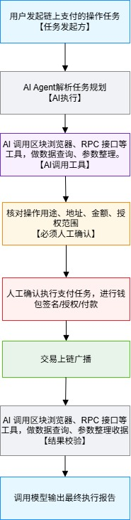

# 最小 AI×Web3 链上支付工作流设计说明（终版）

## 一、设计目标：流程解决的核心问题
本套工作流用于平衡AI辅助效率与链上资产安全，解决三类实际痛点：
1. **降低操作门槛**
解决用户看不懂链上交易参数、不会查询链上数据、无法自主识别风险的问题，由AI承担信息解析、参数整理、数据查询工作，简化专业操作理解难度。

2. **规避AI相关资产风险**
防范AI幻觉生成错误参数、自动发起交易、绕过用户权限执行操作等隐患，通过人机分离的流程边界，杜绝智能体越权操作造成资产损失。

3. **实现操作可追溯核验**
补齐传统手动交易无流程记录、结果难以校验、故障无法溯源的短板，形成闭环执行链路，操作全程留痕，便于复盘排查问题。

## 二、流程节点与主体分工
| 步骤 | 流程内容 | 主体角色 |
| :--- | :--- | :--- |
| 1 | 用户发起链上支付、授权、合约交互类任务 | 用户（任务发起方） |
| 2 | AI Agent 拆解需求，制定整体执行规划 | AI Agent |
| 3 | 调用链上工具接口，查询数据并整理交易参数 | AI Agent（工具调用） |
| 4 | 核对地址、金额、授权范围等关键信息 | 用户（强制人工确认） |
| 5 | 钱包内手动完成签名、授权、付款操作 | 用户（签名付款环节） |
| 6 | 交易数据广播上链，等待区块确认 | 区块链网络 |
| 7 | 调取交易回执，多维度校验实际执行结果 | AI Agent（结果验证） |
| 8 | 汇总信息，输出完整执行报告 | AI Agent |

## 三、关键环节界定
1. **任务发起方**
全部操作由用户主动发起，AI仅承担辅助处理工作，无自主启动链上操作的权限。

2. **执行主体划分**
AI负责任务解析、工具调用、数据核验、文档输出等无资金风险工作；
用户把控信息核对、签名授权、资金划转等高风险核心操作，掌握最终决策权。

3. **必须人工确认步骤**
参数信息核对节点为硬性卡点，涉及资产与权限变更的操作，必须人工核验无误后，才可进入后续流程，是防控误操作的核心防线。

4. **签名、付款、授权步骤**
该环节为资产操作核心步骤，私钥签名、资金转账、合约授权均在此完成，全程人工操控钱包，AI无法介入操作。

5. **结果验证方式**
- 通过交易哈希查询区块状态与交易回执
- 比对合约事件日志，校验操作行为是否符合预期
- 核对账户余额、授权额度变动数据
- 结合预判信息与链上真实数据，生成审计报告

## 四、潜在风险点与防护逻辑
| 风险类型 | 具体场景 | 防护逻辑 |
| ---- | ---- | ---- |
| 钓鱼恶意合约 | 陌生恶意地址、虚假合约盗取资产 | 人工核验地址真实性，AI辅助风险筛查 |
| 超限授权风险 | 授权范围过大、无限授权侵占账户资产 | 人工核对授权额度，AI识别高危授权参数 |
| 参数填写错误 | 公链选错、金额与地址填写失误 | 双人级参数复核，AI校验格式与代币匹配性 |
| 链上数据延迟 | 交易已广播，节点数据同步滞后 | 多数据源交叉验证，延迟二次查询核对 |
| AI幻觉误判 | 合约解读偏差、生成错误交易参数 | AI仅做信息整理，关键内容人工全覆盖审核 |

## 五、核心边界总结
流程遵循**AI辅助运算，人工掌控核心**的设计原则。
AI依托工具能力简化查询、整理、校验类重复工作，降低Web3使用门槛；所有资金、权限相关高危操作全部交由人工确认执行，从流程层面规避智能体失控风险。整套链路完整闭环、操作可审计溯源，兼顾使用效率与资产安全，是AI与链上操作结合的基础安全运行模式。