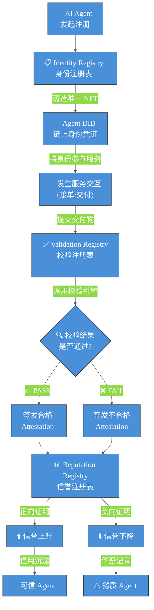
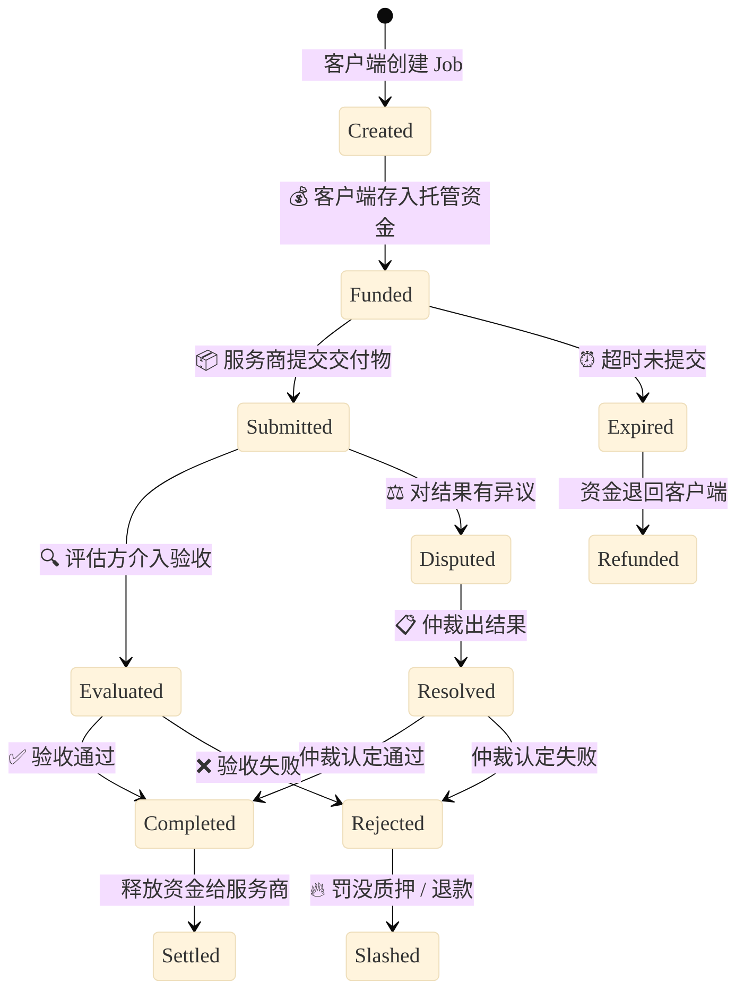
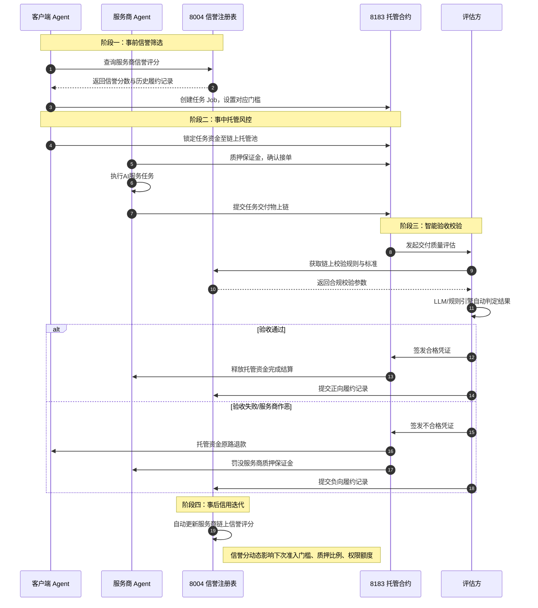

# AI×Web3 核心协议拆解：ERC-8004 & ERC-8183

拆解说明：本文针对 Web3 Agent 生态两大核心配套标准 ERC-8004、ERC-8183 进行结构化拆解，分别从解决问题、AI 模块、Web3 模块、可验证公开材料、学习收获与疑问五个维度落地分析，完整呈现链上 AI 自主商业的底层信任+商业闭环逻辑。

核心定位关系：ERC-8004 是 Agent 信任底层（身份+信誉+校验），ERC-8183 是 Agent 商业执行层（任务+托管+结算），二者组合构成完整的链上 Agent 自主交易体系。
---

## 一、ERC-8004（Trustless Agents 无信任智能体信任标准）

### 1. 它在解决什么问题？

传统 AI Agent 交易存在致命短板：无统一链上身份、无公开信誉体系、交付质量无法链上校验。跨主体、无前置信任的 AI 服务交互中，用户无法甄别 Agent 服务优劣，服务商作恶、劣质交付无公开记录，也无标准化的第三方校验机制，导致链上 Agent 商业无法规模化落地。
ERC-8004 核心解决：去中心化无信任场景下，AI Agent 的身份确权、信誉沉淀、交付结果可验证问题，为 Agent 商业交易提供可信底层支撑，填补链上 Agent 信任空白。

### 2. AI 部分是什么？

聚焦 AI 智能体的能力与交互逻辑，完全服务于 AI 自主协作场景：

- **AI Agent 身份标准化**：为所有链上 AI Agent 定义统一身份规范，适配各类大模型、智能体工具，实现跨平台、跨生态 Agent 识别与互通。
- **AI 服务质量量化**：针对 AI 交付成功率、响应速度、服务稳定性等模型能力，提供标准化评分标签，实现 AI 服务质量可量化、可追溯。
- **AI 交付结果校验适配**：兼容 LLM 校验、ZK 证明校验、TEE 可信执行校验等多种 AI 验证方式，适配不同风险等级的 AI 任务场景。

### 3. Web3 部分是什么？

依托区块链原生特性，搭建三层链上信任注册表，是标准的 Web3 链上基建：

- **身份注册表**：基于 ERC-721 实现，每个 AI Agent 对应唯一链上 NFT 身份，附带可更新的链下服务资料，身份可确权、可迁移、不可篡改。
- **信誉注册表**：链上存储 Agent 服务评价、评分数据，支持评分新增、撤销、回复，所有信誉记录公开可查、永久溯源，杜绝刷分造假。
- **校验注册表**：提供链上校验接口，支持发起 AI 任务校验、记录校验结果，可对接质押校验、ZK 校验等链上安全机制。

### 📊 ERC-8004 三层信任架构流转图

### 4. 可验证公开材料（可直接访问）

1. **官方 EIP 草案文档（权威规范）**：https://eips.ethereum.org/EIPS/eip-8004
2. **以太坊官方 GitHub ERCS 源码文件**：https://github.com/ethereum/ERCs/blob/master/ERCS/erc-8004.md
3. **Fellowship of Ethereum Magicians 官方讨论帖**：https://ethereum-magicians.org/t/erc-8004-trustless-agents/25098
4. **Polygon 官方 Agentic Payments 文档**：https://docs.polygon.technology/payment-services/agentic-payments/agent-integration/erc8004
5. **QuickNode：ERC-8004 开发者指南**：https://blog.quicknode.com/erc-8004-a-developers-guide-to-trustless-ai-agent-identity/
6. **8004scan 官方浏览器**：https://www.8004scan.io
7. **中文解析：解析ERC-8004: Trustless Agents**：https://zhuanlan.zhihu.com/p/2006693137666548014

### 5. 学习收获与现存疑问

**学习收获：**

- 厘清了 AI Agent 链上信任的底层逻辑：身份可确权、信誉可沉淀、结果可校验，打破了传统 AI 无链上信用的局限。
- 理解了 AI 能力与 Web3 链上基建的结合方式：AI 负责服务交付与质量判定，链上负责数据存证、规则固化、信用溯源。
- 掌握了标准化 Agent 生态的设计思路：分层解耦，身份、信誉、校验独立模块化，可灵活适配各类 AI 任务场景。
  **现存疑问：**
- 协议原生仅提供评分存证，如何有效抵御女巫攻击、恶意刷好评/刷差评，是否需要配套链下风控算法辅助？
- 多链部署场景下，Agent 信誉数据如何跨链同步、统一聚合评分，目前是否有成熟的跨链适配方案？

---

## 二、ERC-8183（Agentic Commerce 智能体商业标准）

### 1. 它在解决什么问题？

现有链上交互只有转账、Swap 等简单资产流转，没有适配 AI 任务的「劳务商业闭环」。AI Agent 自主接单、交付、结算场景中，存在资金无托管、交付无验收、作恶无惩罚、交易无凭证的问题，无法实现无人值守的机器自主商业交易。
ERC-8183 核心解决：AI Agent 任务式商业交易的标准化闭环问题，实现任务创建、资金托管、交付提交、结果评估、自动结算全流程链上标准化，让机器和机器之间可以安全做生意。

### 2. AI 部分是什么？

聚焦 AI 自主商业的任务流转与智能履约，适配 Agent 无人值守特性：

- **AI 任务标准化定义**：将 AI 数据查询、文档生成、接口调用、链上分析等各类智能服务，统一封装为链上 Job 任务原语。
- **AI 交付自主提交**：支持 AI Agent 自主完成任务执行、交付物打包、结果上链提交，无需人工干预。
- **AI 智能评估适配**：兼容 LLM 模型作为第三方评估者，自动判定 AI 交付质量，实现全链路智能化验收。

### 3. Web3 部分是什么？

依托智能合约实现链上商业规则固化、资金安全托管与可信结算，是 Agent 商业的链上执行核心：

- **三方角色链上固化**：标准化定义客户端（需求方）、服务商（执行方）、评估方（验收方）三大核心角色，权责清晰、链上可查。
- **链上资金托管**：任务启动后资金自动锁定托管，杜绝甲方赖账、乙方白干活，完成验收后自动分账。
- **任务状态链上流转**：规范任务创建、执行、交付、验收、结算、过期失效全流程状态，所有操作永久上链、不可篡改。
- **可拓展奖惩机制**：可对接质押罚没、声誉扣分等机制，为劣质交付、恶意作恶提供链上惩罚依据。

### 📊 ERC-8183 任务状态机流转图

### 4. 可验证公开材料（可直接访问）

1. **官方 EIP 草案文档（权威规范）**：https://eips.ethereum.org/EIPS/eip-8183
2. **Fellowship of Ethereum Magicians 官方讨论帖**：https://ethereum-magicians.org/t/erc-8183-agentic-commerce/27902
3. **GitHub: erc-8183 参考实现仓库**：https://github.com/erc8183/erc8183-reference
4. **GitHub: erc-8183 topic 页面（生态仓库集合）**：https://github.com/topics/erc-8183
5. **QuickNode：What is ERC-8183? The New Commerce Layer for AI Agents**：https://blog.quicknode.com/erc-8183-agentic-commerce/
6. **中文解读：ERC-8183详解：AI智能体的商业层，开启代理经济时代**：https://zhuanlan.zhihu.com/p/2017657973166613617

### 5. 学习收获与现存疑问

**学习收获：**

- 理解了 Agentic Commerce（机器自主商业）的核心本质：不是简单 AI 自动化，而是链上规则固化的可信机器交易闭环。
- 掌握了 AI 商业的核心三要素：标准化任务、托管资金、客观验收，三者缺一无法实现规模化自主商业。
- 明确了协议极简设计思想：只做核心商业原语，不冗余嵌套仲裁、议价功能，保证协议轻量化、高可拓展性。
  **现存疑问：**
- 协议原生仅支持基础验收结算，如何原生适配梯度罚没、多级声誉奖惩的精细化治理场景？
- 当 LLM 评估出现幻觉、判定失误时，协议是否预留人工终审、结果修正的接口？

---

## 三、双协议联动总结（核心闭环）

1. **ERC-8004（信任层）**：解决「Agent 可信问题」，提供身份、信誉、校验的底层信用底座；
2. **ERC-8183（商业层）**：解决「Agent 交易问题」，提供任务、托管、结算的商业执行链路；
3. **联动闭环**：8004 的信誉数据、校验结果，可反向驱动 8183 的任务准入、资金结算、奖惩执行，构成「事前信誉筛选、事中托管风控、事后信用迭代」的完整 AI 链上商业体系，也是当前 Web3 Agent 赛道最前沿的官方标准组合。

### 📊 8004 + 8183 端到端联动闭环图

