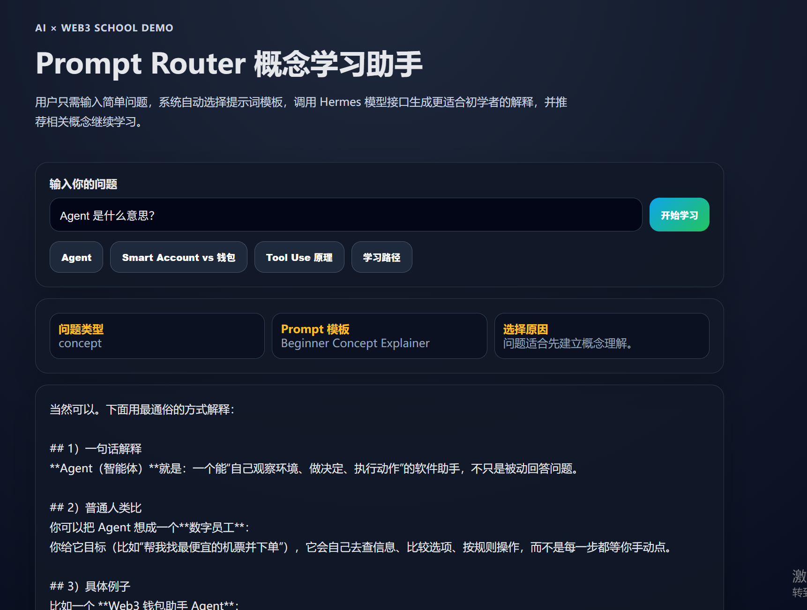
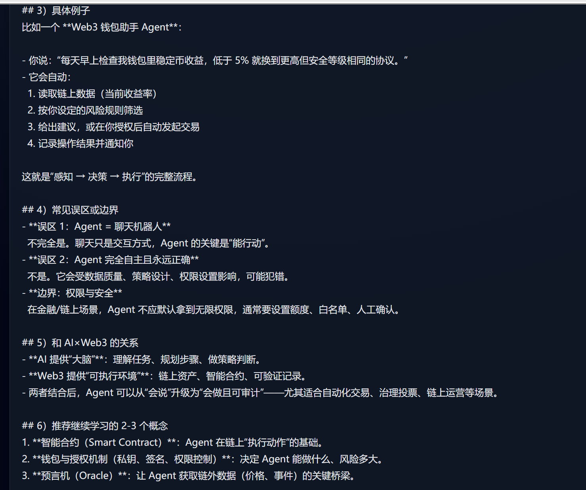
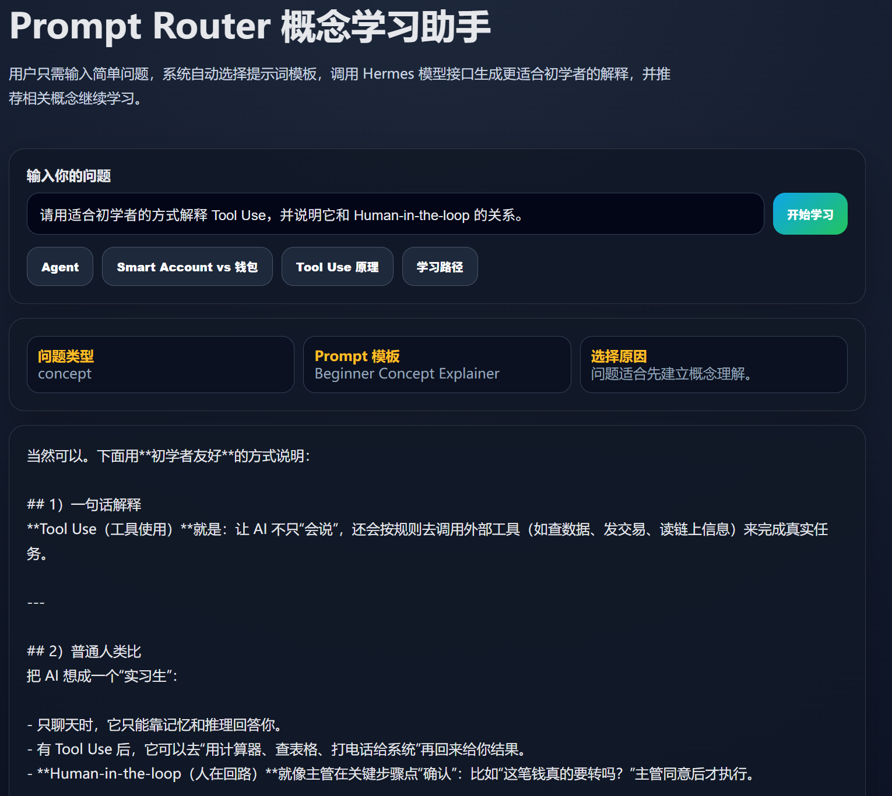
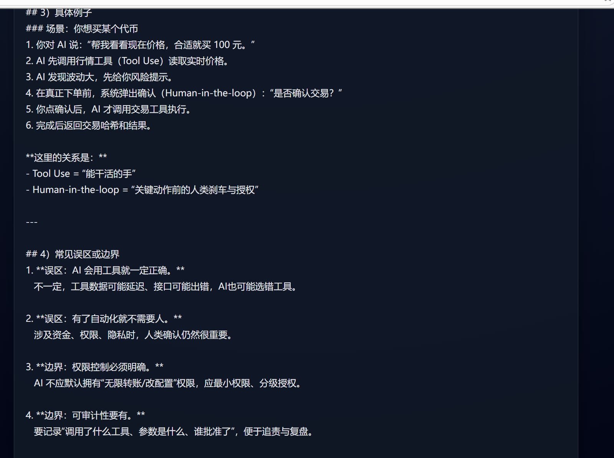

# AI×Web3 Prompt Router Demo 提交说明

## 一、作品目标
本 Demo 是一个最小可运行的 AI×Web3 联网学习助手。它围绕“用户提问 → 问题类型识别 → Prompt 模板路由 → Hermes 模型接口回答 → 推荐继续学习概念”的路径，展示如何把 AI 能力嵌入课程学习场景中，帮助初学者更稳定地理解 Agent、Tool Use、Smart Account、Prompt 等 AI / Web3 高频概念。

## 二、Demo 位置
- Demo 代码目录：`experiments/aixweb3-prompt-router-demo/`
- 后端入口：`experiments/aixweb3-prompt-router-demo/main.go`
- 前端入口：`experiments/aixweb3-prompt-router-demo/web/index.html`
- 环境变量示例：`experiments/aixweb3-prompt-router-demo/.env.example`
- 提交文档：`submissions/aixweb3-prompt-router-demo/README.md`
- 素材目录：`submissions/aixweb3-prompt-router-demo/assets/`

## 三、核心功能
1. 用户输入 AI / Web3 学习问题，例如“Agent 是什么意思？”或“Smart Account 和普通钱包有什么区别？”
2. Go 后端根据关键词判断问题类型，并选择对应 Prompt 模板。
3. 系统通过 OpenAI-compatible 方式调用 Hermes 模型接口。
4. 页面展示问题类型、模板名称、路由原因、AI 回答和后续学习概念。
5. 用户可以点击推荐概念继续追问，形成连续学习路径。

## 四、技术结构
```text
experiments/aixweb3-prompt-router-demo/
├── main.go                 # HTTP 服务与 API 路由
├── go.mod                  # Go 模块配置
├── .env.example            # 本地环境变量示例，不包含真实密钥
├── internal/
│   ├── ai_client.go        # Hermes / OpenAI-compatible 模型接口调用
│   ├── config.go           # 本地 .env 加载
│   ├── prompts.go          # Prompt 模板与概念推荐
│   └── router.go           # 问题类型识别与模板路由
└── web/
    ├── index.html          # 页面结构
    ├── style.css           # 页面样式
    └── app.js              # 前端交互逻辑
```

## 五、输入与输出示例
提问agent的时候:


提问human in the loop的时候:



## 六、AI 辅助与人工验证说明
AI 辅助完成的部分：
- Demo 产品方向与学习路径设计；
- Go 后端、Prompt 路由、AI Client 与前端页面初始代码；
- 提交文档结构整理；
- 风险边界和本地运行说明梳理。

人工修改或验证的部分：
- 确认 Demo 不涉及真实钱包连接、私钥、助记词、签名、授权、转账或合约写入；
- 第一版设计与我构思的不一样,将我的构想告诉它后进行二次设计,要求它先把设计告诉我,经我确认后执行
- 检查 `.env.example` 不包含真实 API Key；
- 运行 Go 构建或本地服务验证基础功能；
- 在浏览器中检查问题输入、模板路由、回答展示与推荐概念交互。

## 七、如何运行
前置条件：本地已安装 Go，并准备可用的 Hermes / OpenAI-compatible 模型接口。

运行步骤：
```bash
cd experiments/aixweb3-prompt-router-demo
cp .env.example .env
# 编辑 .env，填入本地模型接口配置，不要提交真实密钥
go run .
```

浏览器打开：
```text
http://localhost:8080
```

## 八、风险与限制
1. 本 Demo 只用于学习辅助，不提供投资、交易、签名或资产操作建议。
2. 模型回答依赖用户本地配置的 Hermes 模型接口，接口不可用时页面会提示检查 `.env`。
3. 当前路由规则是关键词启发式判断，适合课程 Demo，不代表完整生产级意图识别系统。
4. `.env` 必须仅保存在本地，不能提交到 GitHub；仓库只保留 `.env.example`。
5. 涉及 Web3 安全、钱包、账户抽象等主题时，仍需要结合课程资料和官方文档人工复核。

## 九、结果验证
验证方式：
- 检查 Go 代码可以通过 `go test ./...` 或 `go build ./...`；
- 启动服务后访问 `http://localhost:8080`；
- 输入 `Agent 是什么意思？`，确认页面展示概念解释型模板；
- 输入 `Smart Account 和普通钱包有什么区别？`，确认页面展示对比型模板；
- 点击推荐概念按钮，确认可以继续生成新的追问；
- 检查仓库中没有提交 `.env` 或真实 API Key。
