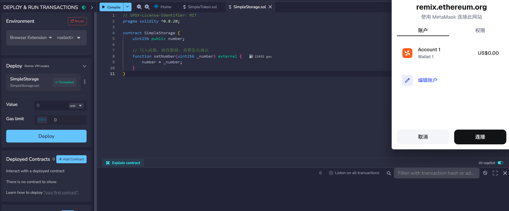
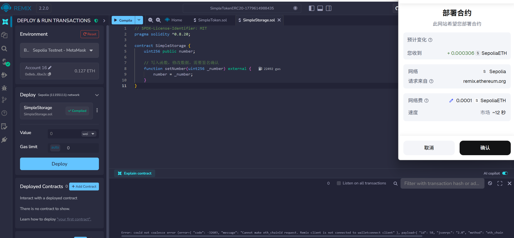
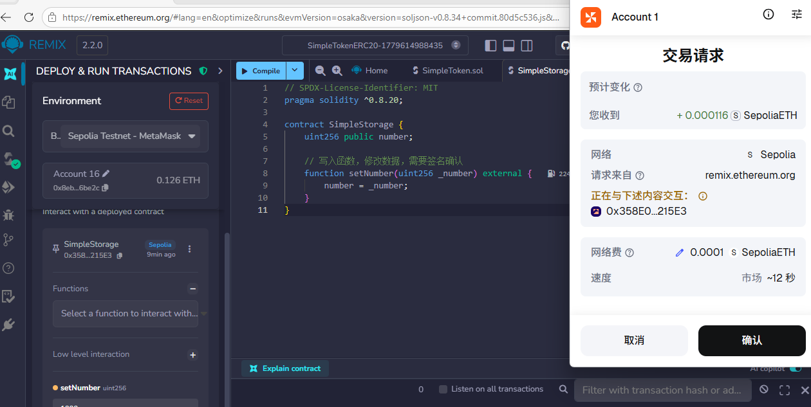
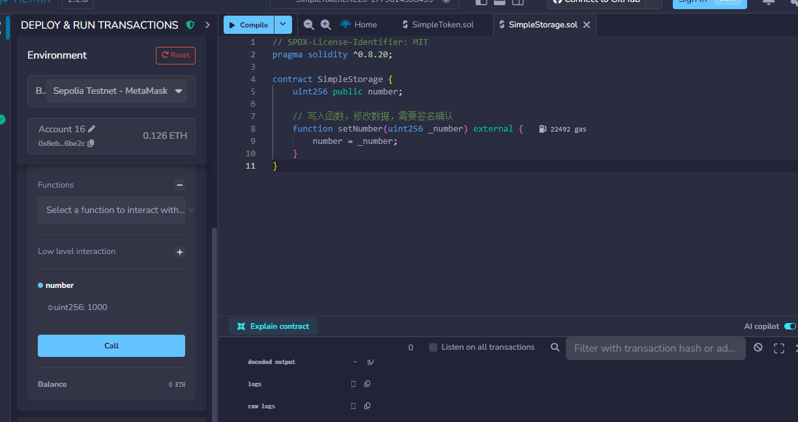
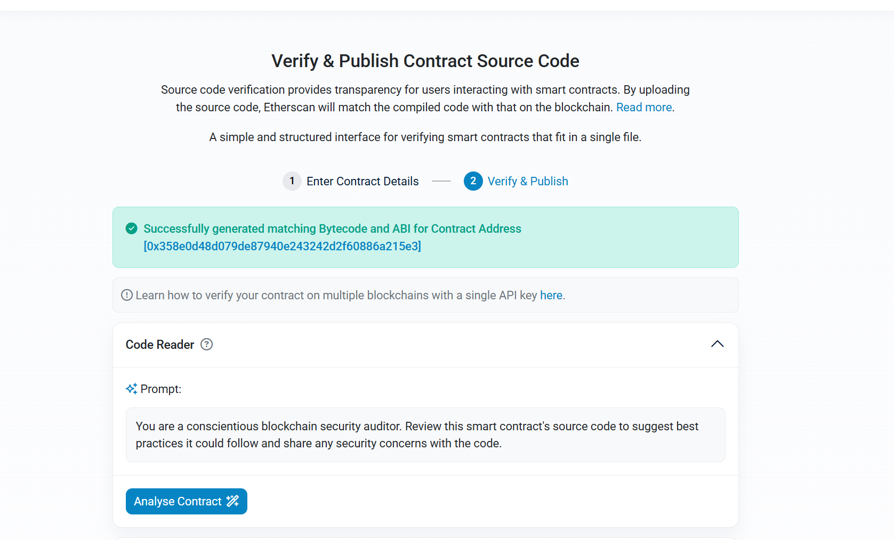
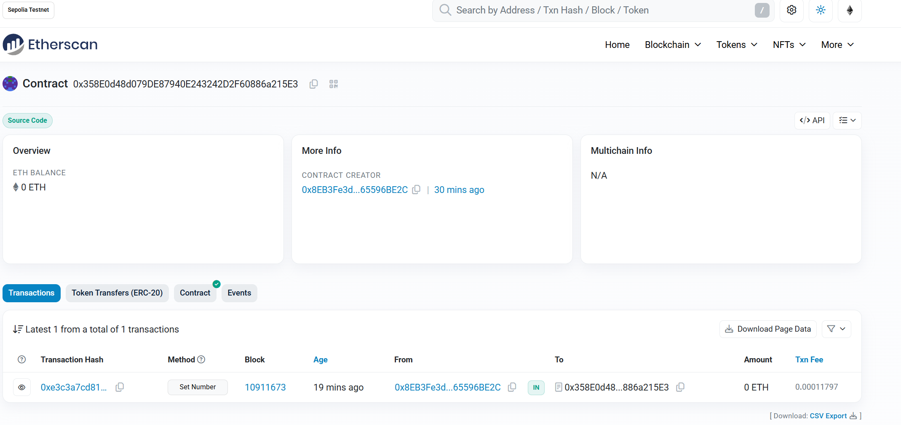

# 作业：Sepolia 测试网智能合约部署与交互实践

---

## 一、任务目标
本次任务旨在通过在 Sepolia 测试网部署并交互一个最小智能合约，深入理解以下核心概念：
- 合约地址的作用与链上标识
- 合约读取（view）与写入（state-changing）操作的区别
- 交易签名、人工确认与链上验证的完整流程

---

## 二、操作环境与工具
- **网络**：Sepolia 测试网
- **工具**：Remix IDE + MetaMask 钱包
- **合约**：`SimpleStorage.sol`（最简状态存储合约）

---

## 三、操作流程与关键截图

### 1. 连接钱包并部署合约
1.  在 Remix 中选择 `Browser Extension` 环境，连接 MetaMask 钱包（已切换至 Sepolia 测试网）。

2.  编译合约后，点击 `Deploy`，MetaMask 弹出部署确认窗口，手动点击「确认」完成交易签名。

3.  交易上链后，Remix 显示合约已成功部署，生成唯一合约地址。

---

### 2. 调用写入函数（状态修改）
1.  在 Remix 合约交互面板，输入数值 `1000`，调用 `setNumber` 函数。
2.  MetaMask 弹出交易请求，手动点击「确认」签名交易。

3.  交易上链后，链上存储的 `number` 状态被更新为 `1000`。

---

### 3. 调用读取函数（状态查询）
1.  在 Remix 合约交互面板，直接点击 `number` 函数（无 Gas 消耗，无需签名）。
2.  合约返回当前链上存储的数值：`1000`，验证写入操作已成功。

---

## 四、链上验证结果
### 1. 合约地址
`0x358E0d48d079DE87940E243242D2F60886a215E3`

### 2. 区块浏览器链接
https://sepolia.etherscan.io/address/0x358E0d48d079DE87940E243242D2F60886a215E32

通过上述链接可在 Sepolia Etherscan 中查看：
- 合约部署交易记录
- `setNumber` 状态修改交易
- 合约代码与链上存储数据

---

## 五、关键理解与总结
1.  **合约地址**：是智能合约在链上的唯一标识，所有交互均需通过该地址进行。
2.  **读取 vs 写入**：
    - **读取（如 `number`）**：免费、无需签名，仅查询链上状态，不产生交易。
    - **写入（如 `setNumber`）**：消耗 Gas、必须通过钱包人工签名确认，修改链上状态。
3.  **交易确认机制**：所有写入操作都需要用户在钱包中手动确认签名，确保只有授权用户能修改合约状态，保障链上安全。
4.  **链上验证**：所有合约交互都会在区块浏览器上留下永久、不可篡改的记录，可随时查询和验证。

---

## 六、提交材料清单
1.  合约地址：`0x358E0d48d079DE87940E243242D2F60886a215E3`
2.  区块浏览器链接：`https://sepolia.etherscan.io/address/0x358E0d48d079DE87940E243242D2F60886a215E3`
3.  读取结果：`number` 函数返回值为 `1000`
4.  写入结果：通过 `setNumber` 将合约状态从 `0` 修改为 `1000`，交易已人工确认并上链。