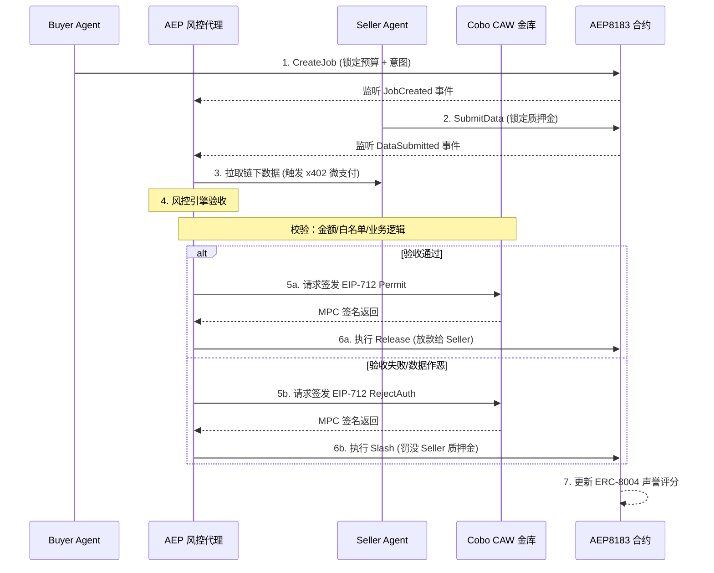

---
# AEP 风控协同代理 设计文档
## 一、核心工作流
AEP Agent 的核心逻辑是**“事件驱动 + 链下风控 + 链上裁决”**的闭环。以下是基于你已有代码架构（`backend-go` + CAW + AEP8183）的完整 Workflow 时序图：

---
## 二、Workflow 关键节点拆解
基于上述流程，我们明确了 AEP Agent 在网络中的核心职能边界：
1. **意图托管期 (Step 1-2)**：买方与卖方的资金被锁定在 AEP8183 合约中，AEP 代理处于待命监听状态。
2. **数据获取期 (Step 3)**：AEP 代理向卖方拉取数据。此时若卖方设置了 x402 付费墙，AEP 代理需通过 CAW 金库进行 MPP 微支付结算。
3. **风控裁决期 (Step 4-5)**：这是 AEP 代理的核心能力。它结合链下业务校验（如 AI 推理准确度）与 CAW 链上策略校验（如每日赔付上限），决定生成 `Permit` 还是 `RejectAuth`。
4. **强制执行期 (Step 6-7)**：代理将 CAW 签名的凭证提交链上，合约验证 EIP-712 签名后执行资金清算，并触发 ERC-8004 声誉的流转。
---
## 三、Agent Profile 草图
基于 Workflow 的拆解，我将 `backend-go` 代码逻辑人格化为 **AEP 风控协同代理**，完成 Module C 的要求：
### 1. Identity（它是谁）
AEP 风控协同代理是代表买方利益的去中心化裁决与执行节点。它是 AEP 网络的“机器法官”，将黑盒的 AI 数据验收转化为链上可验证的密码学裁决。
### 2. Maintainer（由谁维护）
由 AEP 网络的专业节点运营商维护。运营商负责质押资产运行 `backend-go` 实例，并配置 Cobo CAW 的 Pact 策略以控制出签边界。
### 3. Capability（能做什么）
*对应 Workflow Step 3, 4, 5*
- **数据获取与微支付**：拉取卖方链下数据，处理 x402 付费请求。
- **双重风控验收**：执行业务逻辑校验（数据真伪）+ CAW 策略校验（资金安全）。
- **密码学裁决**：生成 EIP-712 签名的放款或罚没意图。
### 4. Input / Output（输入输出）
*对应 Workflow 的触发与结果*
- **Input**: 链上 `JobCreated/DataSubmitted` 事件；链下数据包。
- **Output**: EIP-712 签名凭证；AEP8183 合约执行 TxHash；更新后的声誉评分。
### 5. Collaborators（协作对象）
- **Buyer/Seller Agent**：交易对手方，向 AEP 提交意图与数据。
- **Cobo CAW (资金金库)**：AEP 代理的“钱袋子与保险箱”。代理自身无裸私钥，所有出账必须经 CAW 的 MPC + Pact 策略校验（Workflow Step 5）。
- **AEP8183 Contract (链上法庭)**：验证代理的 EIP-712 签名并强制执行资产转移（Workflow Step 6）。
### 6. Invocation（如何被调用）
- **被动事件驱动**：监听 Anvil 节点事件自动唤醒（主要模式）。
- **主动意图下发**：买方通过 HTTP API 提交高层级风控委托。
### 7. Pricing & Billing（如何收费）
- **风控服务费**：买方发起任务时扣除 1% 预算作为托管费。
- **罚没分成**：代理成功识别作恶并执行 Slash 时，获得卖方质押金的 10% 作为反欺诈激励。
### 8. Verification（如何被验证）
- **密码学不可篡改**：AEP8183 合约通过 `ecrecover` 校验 EIP-712 签名，确保代理的裁决意图无法伪造。
- **链上全审计**：CAW 金库的出签记录与合约的 Event Log 构成完整的证据链。
### 9. Failure Handling（失败如何处理）
*对应 Workflow 中的异常分支*
- **卖方数据作恶 (验收失败)**：触发 Workflow 5b-6b，代理发起 Slash 罚没，并断崖式降低卖方声誉。
- **代理自身误判/作恶**：买方发起仲裁，若判定代理恶意罚没，罚没代理运营商的质押金，声誉清零。
- **链上交易拥堵**：`backend-go` 的 `tx_queue` 与 `nonce_tracker` 自动调高 Gas 重试，确保裁决不上链不罢休。
---
## 四、加分项：A2A vs MPP 协议对比
在上述 Workflow 中，AEP 代理在**协作**与**支付**两个环节面临截然不同的挑战，这恰好对应了 A2A 与 MPP 的核心用例。
### 1. A2A (Agent-to-Agent Protocol) —— 解决“协作与接口”问题
**核心定位**：标准化异构 Agent 之间的发现、通信与任务委派。
- **解决的问题**： Workflow Step 1-3 中，买方如何向 AEP 下发意图？AEP 如何向卖方请求数据？如果买方是 Python 脚本，AEP 是 Go 后端，它们如何对齐接口？
- **应用场景**：A2A 提供了统一的意图表达格式。买方通过 A2A 发送“请监控 Job #123”，AEP 通过 A2A 返回“已接管并完成验收”。**A2A 只管对话，不管钱。**
### 2. MPP (Micro-Payment Protocol / x402) —— 解决“支付与结算”问题
**核心定位**：解决机器级、高频、极小额度的点对点结算，避免微交易上链导致 Gas 破产。
- **解决的问题**： Workflow Step 3 中，AEP 代理在验收时可能需要调用外部 Web2 API（如调用推特 API 验证情感分析结果），单次调用只值 0.001 USDC。如果走传统 ERC20 Transfer，Gas 远超本金。
- **应用场景**：外部数据源返回 HTTP 402，AEP 代理通过 CAW 金库完成 MPP 限额内的秒级微支付，获取数据后，再汇总多笔微支付在链上做一次批量结算。**MPP 只管钱怎么流，不管任务怎么协调。**
### 3. 协同总结
在 AEP 的 Workflow 中，**A2A 是神经网络（传递意图），MPP 是毛细血管（微额供血），AEP + CAW 是免疫系统（风控裁决）**。三者结合，才构成了可信的 Agent 商业闭环。
