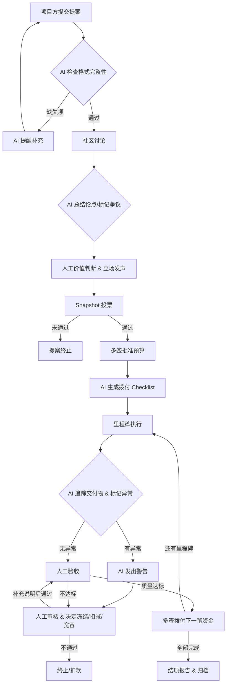

# Module G 产出：DAO 资助提案与预算执行追踪器

## 一、流程拆解：AI 辅助 vs 治理确认边界

以一个 DAO 季度性资助流程为例，我们将步骤拆解为“信息整理”、“行动转化”、“贡献记录”和“治理边界”四个维度：

| 治理阶段 | 具体任务 | AI 可以辅助的部分 🤖 | 必须由人/治理确认的部分 🧑‍⚖️ |
| :--- | :--- | :--- | :--- |
| **1. 提案提交** | 项目方提交资助申请 | 提取提案核心要素(金额/周期/交付物)； 检查格式完整性并提醒补充缺失项 | 评估项目与 DAO 愿景的契合度； 验证团队背景与声明真实性 |
| **2. 社区讨论** | Forum/Discord 激烈辩论 | 总结长帖核心论点(支持/反对)； 标记争议焦点与利益相关方 | 权衡利弊进行价值判断； 代表社区立场进行发声或游说 |
| **3. 投票表决** | Snapshot / Tally 发起投票 | 格式化提案生成 Snapshot 模板； 基于讨论串草拟投票选项 | 批准投票上链； 持有代币进行实际投票 |
| **4. 预算执行** | 资金分阶段拨付 | 生成拨付 Checklist 及条件逻辑； 追踪里程碑到期日并发送提醒 | 批准资金释放； 多签签署实际转账交易 |
| **5. 贡献记录** | 交付物验收与 PoH 记录 | 抓取 GitHub PR/链上数据生成履约报告； 对比提案承诺与实际交付差异 | 判定交付质量是否达标； 决定惩罚(扣减)或激励(追加) |

---

## 二、工作流流程图

以下流程图展示了一个资助提案从提交到结项的完整路径。

---

## 三、草图设计：Budget Execution Checklist（预算执行追踪工作流）

以下是基于 Markdown / Notion 视角的追踪器草图。核心逻辑是：**AI 负责填表和亮红灯提醒，人类负责按下绿色的“确认放款”按钮。**

### 📋 DAO Grant: 季度资助执行看板

**项目名称:** ZK-Rollup 社区教育计划  
**申请金额:** 10,000 USDC  
**执行状态:** 🟡 进行中 (Milestone 2 待审核)  

---

#### 📍 Milestone 1: 课程大纲与首期内容 (预算: 3,000 USDC)

- **承诺交付物:** 10 篇 ZK 入门教程, 1 个 Demo 仓库
- **交付状态:** 
  - [x] GitHub Repo 链接: `github.com/zk-edu/demo` 🤖 *AI 验证: Repo 存在, 最新提交于 3 天前*
  - [x] 教程发布链接: `mirror.xyz/zk-edu` 🤖 *AI 验证: 包含 10 篇文章, 提取关键词匹配度 85%*
- **AI 履约摘要:** 🤖 
  > 交付物已按期提交。文章阅读量平均 500+，Repo 获得 15 个 Star。未发现抄袭迹象。但文章难度偏向初级，与提案中“面向开发者”的定位有轻微偏差。
- **人类审核与判定:** 🧑‍⚖️ 
  > [Board Member A]: 内容质量可以接受，轻微定位偏差可在下期修正。**同意验收。**
- **预算动作:** 🟢 **已拨付** 3,000 USDC (TxID: `0xabc...123`) - *多签确认批准*

---

#### 📍 Milestone 2: 线下工作坊举办 (预算: 5,000 USDC)

- **承诺交付物:** 2 场线下工作坊, 至少 50 人参与, 签到表与照片
- **交付状态:**
  - [ ] 活动照片与视频 🤖 *AI 验证: IPFS 上传了 20 张图片, 图像识别检测到人群聚集场景*
  - [ ] 签到表 POAP 铸造记录 🤖 *AI 验证: 链上 POAP 铸造数量为 42 个 (低于承诺的 50 人)*
- **AI 履约摘要:** 🤖
  > ⚠️ **异常警告**：参与人数未达标 (42/50)。提供照片显示场地规模较小。提案中声明需预定大型场地，预算可能未被合理使用。
- **人类审核与判定:** 🧑‍⚖️
  > [Board Member B]: 需要项目方解释人数不达标原因及场地预算去向。**暂停拨付，要求补充说明。**
- **预算动作:** 🔴 **冻结** - 待治理讨论决定是扣减预算还是允许延期补救。

---

#### 📍 Milestone 3: 最终报告与复盘 (预算: 2,000 USDC)

- **承诺交付物:** 数据分析报告, 资金使用明细表
- **交付状态:** ⏳ 未到期
- **AI 进度追踪:** 🤖 距离截止日期还有 14 天，无需干预。
- **人类审核与判定:** 🧑‍⚖️ 未启动
- **预算动作:** ⚪ 待执行

---

## 四、核心设计原则：边界不可逾越

在本设计中，严格遵循以下标记与规则，确保“效率提升”不演变为“治理风险”：

1. **🤖 AI 总结 🚫 决策**
   - AI 生成的摘要（如“图像识别检测到人群”）仅作为**证据的预处理**，降低人类翻阅海量资料的门槛。
   - **反例警示**：绝不能设定规则为“如果 AI 识别到图片有人群，自动触发智能合约打款”。图片完全可以是 AI 生成的或盗用的，图像识别不是最终性证明。

2. **🧑‍⚖️ 价值判断与预算动作必须经多签/投票**
   - 即使 AI 发现里程碑完美履约，资金拨付的 Checklist 最后一项必须是 `require(multisig_approval == true)`。
   - AI 可以生成 Transaction payload，但**签名权必须在人类治理者手中**。

3. **AI 标记的“异常”是讨论起点，而非终局惩罚**
   - 如 Milestone 2 中 AI 标记人数不达标，这只是一个“黄牌警告”。真正决定扣款（惩罚）或宽容（激励）的，必须是社区基于上下文的讨论（如是否因天气原因导致人数减少），这是 AI 无法理解的“人情与语境”。

4. **贡献记录的可验证性**
   - AI 抓取的链上数据（如 POAP 铸造数、GitHub Commit）属于**硬事实**。
   - 但“代码质量是否高”、“活动是否真的有帮助”属于**软贡献**，AI 只能辅助统计（如 Star 数），定性评价必须由社区人工打分或通过代币投票体现。

---

**提交说明**：以上内容包含流程拆解表格、Mermaid 流程图、预算执行追踪器示例及核心原则。所有示例均不包含私钥、API Key 或真实资金信息。