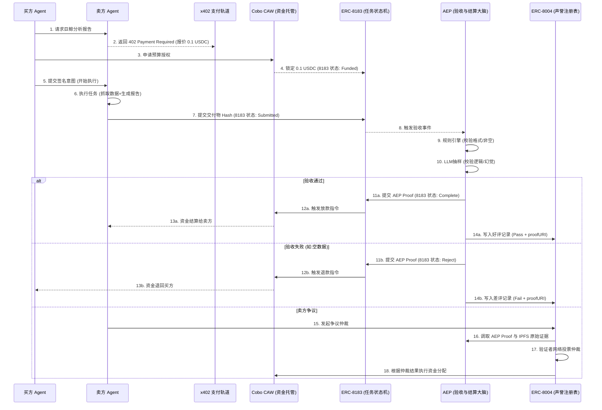

---
# Week 2 Module B 作业：Agent Commerce 最小闭环流程设计
## 一、 场景选择：链上巨鲸追踪报告
**场景描述**：普通交易员（人类或主理人 Agent）需要监控某巨鲸地址的近期异动，但缺乏实时链上数据分析能力。交易员向专业的“链上数据分析 Agent”购买一份定制化的巨鲸追踪报告。
**痛点**：报告单价低（微支付），但内容容易造假（AI 幻觉或直接返回空数据），买卖双方互不信任，需要担保交易与客观验收。
**补充说明** AEP(Agent Escrow Protocol)是我本次黑客松的一个构思,还在逐步完善中。
### 角色拆解
| 角色 | 谁来承担 | 核心职责 |
| :--- | :--- | :--- |
| **谁下单** | **买方 Agent / 人类** | 发起数据需求，提供目标地址，授权预算 |
| **谁执行** | **卖方 Agent** (数据分析Agent) | 抓取链上数据，调用 LLM 生成结构化分析报告 |
| **谁验收** | **AEP (Agent Escrow Protocol)** | 作为 ERC-8183 的 Evaluator，执行规则+LLM抽样质检，输出 AEP Proof |
| **谁付款** | **买方智能钱包** (Cobo CAW) | 托管资金，根据 AEP 的验收结果执行放款或退款 |
| **谁仲裁** | **ERC-8004 验证者网络** | 发生争议时，基于 AEP 提供的链上 Proof 和 IPFS 证据进行人工/多签仲裁 |
---
## 二、 最小 Payment / Commerce Flow 设计
基于 x402 + ERC-8183 + AEP + Cobo CAW + ERC-8004 的完整流转时序：

### 流程步骤详解
1. **报价**: 买方向卖方发起 HTTP 请求，卖方通过 x402 协议返回 `402 Payment Required` 状态码及报价签名。
2. **预算授权**: 买方确认报价，向 Cobo CAW 发起审批。CAW 校验限额后，将 0.1 USDC 锁定在 ERC-8183 的 Job 合约中，状态变为 `Funded`。
3. **执行**: 卖方 Agent 监听到资金锁定事件，开始抓取链上数据并调用大模型生成分析报告。
4. **交付**: 卖方将生成的报告加密/IPFS上链，并将 Hash 提交至 ERC-8183 合约，状态变为 `Submitted`。
5. **验收**: **【AEP 核心环节】** 8183 合约将验收逻辑委托给 AEP。AEP 链下执行：
   - *规则引擎*：校验报告 JSON 是否包含必要字段（如 `risk_score`, `tx_list`），是否为空。
   - *LLM 抽样*：若金额>1U，按概率调用 LLM 校验报告内容是否与输入地址相关，是否出现幻觉。
6. **付款 / 退款**: 
   - AEP 验收通过，生成 `AEP Proof (Pass)` 调用 8183 合约触发 `Complete`，CAW 将托管资金打给卖方。
   - AEP 验收失败（如返回了空数据），生成 `AEP Proof (Fail)` 触发 `Reject`，CAW 自动原路退款给买方。
7. **争议与仲裁**: 若卖方认为 AEP 误判，可向 ERC-8004 发起争议。8004 的验证者节点将读取 AEP 存在 IPFS 上的完整校验日志与原始数据，进行人工/多签仲裁，推翻或维持 AEP 判决。
8. **记录证明**: 无论通过或失败，AEP 都将生成包含 `proofHash` 和 `proofURI` 的声誉凭证，写入 ERC-8004 的 Reputation Registry，作为该 Agent 未来的“链上履历”。
---
## 三、 加分项：协议比较分析 (x402 vs ERC-8183)
在上述流程中，**x402** 和 **ERC-8183** 分别扮演了完全不同的角色，它们一个解决“通信与报价”，一个解决“状态与结算”。
| 维度 | x402 (HTTP 402 支付轨道) | ERC-8183 (Agentic Commerce 协议) |
| :--- | :--- | :--- |
| **解决什么问题** | **支付请求与通信** | **任务状态机与资金结算** |
| **核心机制** | 基于 HTTP 状态码 `402`，在 API 请求层嵌入支付意图和报价签名。 | 基于智能合约的 Job 状态流转 (`Open` → `Funded` → `Submitted` → `Complete/Reject`)。 |
| **在流程中的定位** | **前端交互层**：告诉买方“要花钱，花多少”。 | **后端账本层**：记录钱“锁没锁，该给谁”。 |
| **局限性** | 只管“怎么要钱”，不管“货不对板怎么办”，无担保交易能力。 | 只管“状态流转”，但不知道“交付的货到底对不对”（Evaluator 插槽为空）。 |
| **与 AEP 的关系** | AEP 不处理 x402，x402 仅是触发资金锁定的前置信号。 | AEP 是 ERC-8183 的 **标准 Evaluator 实现**，填补了其“如何判断交付合格”的空白大脑。 |
**总结论**：
x402 是 Agent 之间“讨价还价”的嘴，ERC-8183 是 Agent 之间“签合同走流程”的手，而 **AEP 则是 Agent 之间“验货拍板”的脑**。没有 x402，Agent 无法发起商业请求；没有 ERC-8183，资金无法安全托管；而没有 AEP，8183 就只是个盲目放款的漏斗。三者结合，才构成了真正的 Agent 商业闭环。
