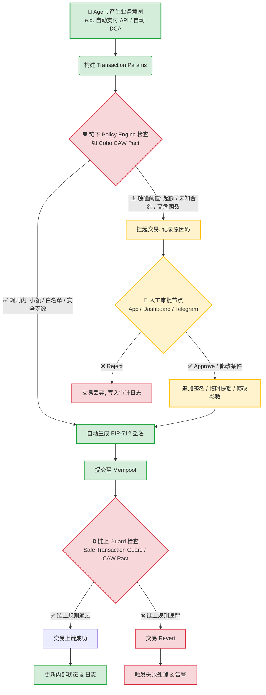

# Module D｜Wallet / Permission / Safe Execution

## 一、Agent 发起链上动作的执行流程图

下面是基于 MPC + 策略引擎（如 Cobo CAW Pact）+ Safe / Guard 的典型执行流程，已标注哪些步骤可自动化，哪些必须人工确认。

### 流程节点属性说明

- **🤖 全自动化节点**：`A`, `B`, `D`, `I`, `M`  
  业务意图构造、常规签名、上链、状态更新，机器处理远快于人，无需干预。
- **🛡️ 自动拦截 / 校验节点**：`C`, `J`  
  机器执行策略校验，违背规则直接拦截，避免垃圾请求轰炸人类。
- **👤 人工确认节点**：`E`, `F`, `H`  
  仅当触碰阈值时触发，人类作为“最终守门人”对异常意图做自由裁量。
**设计要点**：  
- **默认在边界内全自动，撞线才拉人**，而不是“每笔都人工”；  
- 边界由预算 + 白名单 + Guard 三重定义，人类拥有“最终否决权 + 冻结权”，但日常不干预。

---

## 二、Agent Wallet 场景权限策略设计

以一个 **AEP Guardian Agent Wallet** 为例：

- 用户：个人 / 项目金库 owner；  
- Agent：代表用户在预设边界内自动执行 DeFi / 支付任务；  
- 架构：MPC（CAW）+ Safe + Guard / Pact。

### 1. 预算：分层额度 + 自动熔断

| 层级 | 场景 | 单笔上限 | 日累计上限 | 自动/人工 | 设计意图 |
|------|------|----------|------------|-----------|----------|
| 微支付层 | x402 API 费用、小额订阅 | ≤ 1 USDC | ≤ 10 USDC | 全自动 | 机器高频微操作，无需人工打断 |
| 常规业务层 | 数据采购、小额 DCA | ≤ 50 USDC | ≤ 500 USDC | 自动 + 强 Guard | 日常策略执行，但必须走白名单合约 |
| 高风险层 | 大额投资、金库调仓 | > 50 USDC 或 > 500 USDC/日 | — | 必须人工确认 | 大额支出必须有人类明确审批 |

**熔断规则**：  

- 同一 Job / 同一对手方连续失败 ≥ N 次 → 自动暂停该类意图；  
- 日预算消耗速度异常（如 10 分钟烧掉 80%）→ 自动降频或暂停。

### 2. 可调用合约：白名单 + Recipe

参考 CAW 的 Pact + Recipe 设计：
- **白名单合约（日常自动）**：

  - AEP8183 / 业务合约（release / slash）
  - DEX Router（仅 swap / addLiquidity）
  - x402 / 支付合约
  - Paymaster / Gas 中继
- **未知合约**：
  - 默认拦截 → 走人工审批；
  - 人类审批后可：一次性放行，或加入白名单以后自动。
- **函数级限制**：
  - 允许：`transfer`、`approve`（额度=当次所需）、`swap`、`release`、`slash` 等；
  - 禁止：`transferOwnership`、`upgradeTo`、`setAuthority`、`withdrawAll` 等管理函数。

### 3. 可执行动作：按风险分级

- **低风险（全自动）**：
  - 白名单地址小额 USDC 支付（x402 / API 费用）；
  - 白名单 DEX 小额 swap；
  - “当次额度” approve（禁止无限授权）。
- **中风险（自动 + 强 Guard）**：
  - 中额 swap / DCA / 网格策略；
  - 给有声誉评分的新地址付款；
  - 调用新合约但函数在白名单内。
- **高风险（必须人工）**：
  - 单笔 > 阈值（如 50 USDC）；
  - 调用未知合约 / 未知函数；
  - 向未评级地址转账；
  - 任何涉及合约所有权 / 权限变更的操作。

### 4. 人工确认阈值：撞线才拉人

触发人工审批的任一条件：
1. 单笔金额 > 50 USDC；  
2. 调用不在白名单的合约；  
3. 调用管理类函数（ownership / upgrade / authority）；  
4. 同一 Job 连续失败 ≥ 2 次；  
5. 日累计支出 > 500 USDC；  
6. 目标地址在黑名单 / 风控标签列表中。
**不是每笔都人工，而是撞线才人工**。

### 5. 撤销方式：软硬兼施，但日常尽量自动

- **链下软撤销**（优先）：
  - 交易未上链：Agent / 人类通过 Dashboard / API 发 `Cancel`，CAW 不再签名；
  - 设置 Intent 过期时间：超时未上链自动作废。
- **链上硬撤销**（紧急）：
  - 人类通过多签 / 高权限账户，替换 `nonce` 或调用 `emergencyPause()` 冻结 Agent 权限；
  - CAW 支持手机端一键冻结所有 Pact。
- **自动撤销**：
  - 超时未确认的 Intent 自动取消，避免卡住后续交易。
### 6. 日志记录：为“事后追责 + 策略调优”服务
- **链下全量（低延迟）**：
  - 每个意图：who（Agent）、what（动作）、when（时间）、why（触发规则 / 阈值）、which rule（哪条策略放行 / 拦截）；
  - 人工审批记录：审批人、结果、修改内容。
- **链上关键事件（不可篡改）**：
  - 大额转账 / 罚没 / 放行记录 → 写入 ERC-8004 声誉元数据；
  - Guard Revert 的交易记录错误码，用于调优策略。
### 7. 失败处理：自动恢复 + 人工升级
- **Gas 不足**：
  - 自动走 Paymaster 垫资，或从 DEX 小额兑换 Gas 代币。
- **链上 Revert（被 Guard 拦截）**：
  - 停止重试，标记为“需代码审查”，不自动重放。
- **MPC 签名超时**：
  - 降级为“待人工确认队列”，避免资金卡死。
- **策略冲突**：
  - 有多个 Guard / Pact 规则冲突时，选更严格那条，并告警人工。
---
## 三、ERC-4337、Safe、Guard / Policy 为什么重要，解决哪类风险
### 1. ERC-4337（账户抽象）：解决“密钥单点故障 & Gas 摩擦”
**核心问题**：  
- 传统 EOA 钱包私钥丢失 → 资产永久丢失；  
- 必须持有 ETH 才能付 Gas，新手门槛高；  
- 签名逻辑固定，无法原生支持多签、社交恢复、自动执行。
**ERC-4337 带来的能力**：
- **智能合约钱包作为主账户**：  
  - 验证逻辑（validateUserOp）和执行逻辑（executeUserOp）都可编程；
  - 支持多签、时间锁、支出上限、会话密钥等。
- **Paymaster 代付 Gas / 用 ERC‑20 付 Gas**：  
  - 用户可以没有 ETH，由 DApp / 项目方代付；
  - 适合 Agent 高频自动执行，不会因为缺 Gas 停摆。
- **批量交易 & 会话密钥**：  
  - 一笔 UserOp 里执行 approve + swap + 多步操作；
  - 可以给 Agent 一个“会话密钥”，限定时间内、限额内自动执行。
**解决的风险类型**：
- **密钥单点故障**：从“一个私钥丢就全完” → 可多签、可社交恢复、可轮换密钥；  
- **Gas 摩擦**：从“必须有 ETH 才能玩” → 可无 Gas、可代付、可批量；  
- **自动化障碍**：从“每次都要人点签名” → 可编程权限、会话密钥、自动执行。
对 Agent 钱包来说，ERC-4337 是“**能跑起来的基础**”：  
没有 AA，Agent 要么拿 EOA 私钥（极度危险），要么每次都人肉签名（失去自动化意义）。
---
### 2. Safe（多签智能账户）：解决“资金归属权 & 多签审批”
**核心问题**：  
- 即使有 ERC-4337，如果 Agent 直接掌握某个 EOA 私钥，资金所有权和执行权混在一起；  
- 单一 owner 一旦被攻破，资金瞬间清零；  
- 团队 / DAO 场景缺乏多签审批与权限分层。
**Safe 带来的能力**：
- **资金是 Safe 的，Agent 只是 Module**：  
  - Safe 是智能合约账户，owner / module 分离；  
  - Agent（Module）只能在 Safe 规定的框架内操作资金。
- **多签审批 & 阈值控制**：  
  - 3/5 多签：5 个 owner 中至少 3 个签名才能执行交易；
  - 适合团队金库、DAO 资金、项目财库。
- **模块化扩展**：  
  - 通过 ModuleManager、GuardManager 等模块扩展功能；
  - 可添加 Guard、时间锁、每日限额等。
**解决的风险类型**：
- **单点授权**：从“一个人拿私钥就能卷款” → 多人审批，提高作恶成本；  
- **资金归属权不清**：从“保姆拿金库钥匙” → “金库是 Safe 的，保姆只是被授权的 Module”；  
- **团队 / 机构合规**：提供审批流程、审计轨迹，满足企业 / DAO 治理需求。
对 Agent 钱包来说，Safe 是“**资金归属与审批结构的基础**”：  
Agent 可以跑得飞快，但钱永远在 Safe 里，所有权和执行权分离。
---
### 3. Guard / Policy：解决“AI 幻觉 & 逻辑漏洞导致的越权”
**核心问题**：  
- ERC-4337 + Safe 解决了“谁有权动钱”，但没解决“Agent 会不会乱动”；  
- 大模型幻觉、Prompt 注入、代码 Bug，都可能让 Agent 调用合法但危险的函数（如 `approve(hacker, MAX_UINT)`）；  
- Bybit / WazirX / Radiant 等事件表明：**仅靠多签签名是不够的，需要实时风险扫描和细粒度权限控制**。
**Guard / Policy 机制（Safe Guard + CAW Pact + Coinbase Policy Engine 等）**：
- **Safe Transaction Guard**：  
  - 在 `execTransaction` 前后加钩子（`onBeforeExecTransaction` / `onAfterExecTransaction`）；  
  - 可检查 `to`、`value`、`data`、`operation`（CALL / DELEGATECALL）是否合规；
  - 可禁止 `delegatecall` 未知合约、限制高危函数。
- **CAW Pact**：  
  - 每个任务定义一个 Pact：意图 + 执行计划 + 政策 + 完成条件；  
  - Agent 只能在 Pact 边界内执行，超出则直接拒签；  
  - Pact 是“任务级宪法”，不是长期权限。
- **Coinbase Policy Engine 等**：  
  - 自定义交易政策：白名单地址、支出限额、时间窗口、条件审批。
**解决的风险类型**：
- **AI 幻觉 / Prompt 注入**：Agent 被骗调用恶意函数 → Guard / Pact 在链下 / 链上强制拦截；  
- **逻辑漏洞 / 权限升级**：Agent 试图 `transferOwnership` → Guard 直接 Revert；  
- **粗粒度权限**：从“只要签名就放行” → “先检查规则，再决定是否执行”。
对 Agent 钱包来说，Guard / Policy 是“**最后一道物理定律**”：  
哪怕 Agent 脑子短路，Guard 也能在链上把越权交易 Revert，把损失限制在规则内。
---
## 四、总结：三层防护对应三类风险
| 层级 | 机制 | 核心解决的问题 | 对应风险类型 |
|------|------|----------------|--------------|
| 账户层 | ERC-4337（账户抽象） | 密钥单点故障 & Gas 摩擦 & 自动化障碍 | 私钥丢失、无 ETH 无法操作、每次都要人签名 |
| 所有权层 | Safe（多签智能账户） | 资金归属权 & 多签审批 & 权限分层 | 单点授权、资金归属不清、团队 / DAO 治理缺失 |
| 行为层 | Guard / Policy（Safe Guard + CAW Pact + Policy Engine） | AI 幻觉 & 逻辑漏洞 & 越权操作 | Prompt 注入、恶意调用、权限升级、粗粒度风控 |

**一句话总结**：
- **ERC-4337** 让 Agent 钱包“**能自动跑起来**”；  
- **Safe** 让 Agent 钱包“**钱归谁所有、谁有权批**”；  
- **Guard / Policy** 让 Agent 钱包“**跑得再快，也飞不出规则边界**”。
