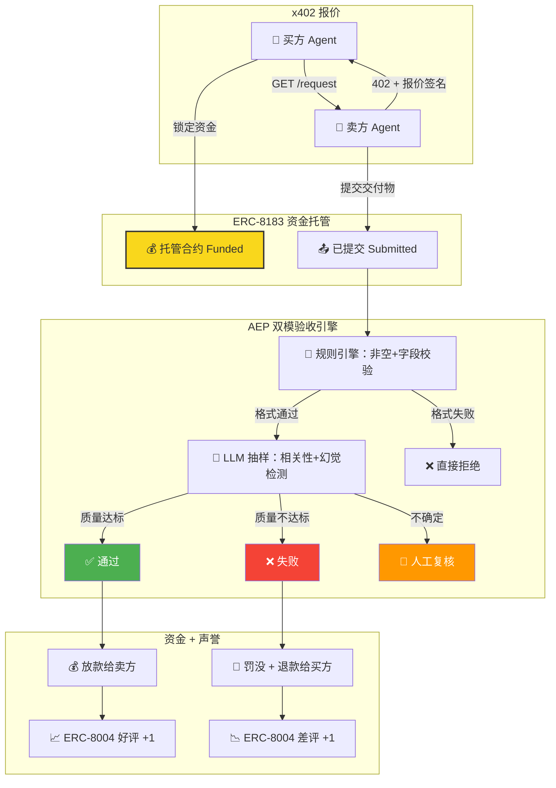

# Week 2 方向深挖包 & 项目初步 Proposal

> AI × Web3 School 第2周主线交付
> 学员：zane199109 | GitHub: [@zane199109](https://github.com/zane199109)
> 主方向：Payment / Commerce / Settlement — Agent 自主商业的可信结算
> 项目：AEP (Agent Escrow Protocol) — 链上担保交易的 AI 验收引擎

---

## 任务完成汇总

| # | 任务 | 状态 | 链接 |
|---|------|------|------|
| 1 | AI × Web3 问题地图（6方向覆盖） | ✅ | 见本文第一章 |
| 2 | 方向选择说明（Payment/Commerce主方向） | ✅ | 见本文第二章 |
| 3 | 问题拆解（参与方/流程/AI作用/Web3/边界/风险） | ✅ | 见本文第三章 |
| 4 | 项目初步 Proposal（AEP协议 + MVP定义） | ✅ | 见本文第四章 |
| 5 | 主方向深挖包（流程图/典型场景/反例/风险/验证计划） | ✅ | 见本文第五章 |
| 6 | 参考资料清单（7条） | ✅ | 见本文第六章 |
| 7 | 方向 Backlog | ✅ | 见本文第七章 |
| 8 | x402+CAW Agent 自主支付闭环 Demo | ✅ 三场景合法+钓鱼+超额全部设计完成 | [提交文档](week2-x402-Paywall-CAW-Agent-Payment-Closed-Loop.md) · [实验代码](../../experiments/x402-caw-demo/) |
| 9 | Agent Wallet 权限策略设计（三层分层额度+Guard） | ✅ | [提交文档](week2-Permission-Strategy-for-Agent-Initiated-On-Chain-Actions.md) |
| 10 | AEP 威胁模型与安全边界设计 | ✅ | [提交文档](week2-Agent-Workflow-Threat-Model-and-Confirmation-Strategy.md) |
| 11 | Governance 治理流程草图 | ✅ | [提交文档](week2-Governance-and-Coordination-Workflow-Sketch.md) |

---

## 一、AI × Web3 问题地图（6 方向）

| 方向 | 核心问题 | AI 作用 | Web3 机制 |
|------|---------|---------|-----------|
| **Payment / Commerce / Settlement** | Agent 付了钱货不对板怎么办 | 意图理解、交付验收、动态定价 | 托管合约（ERC-8183）、罚没、x402 微支付、结算原子性 |
| **Identity / Reputation / Capability** | Agent 无链上身份，换个地址就能洗白 | 能力量化、行为特征提取、跨域适配 | ERC-8004 NFT 身份、EAS 链上 Attestation、声誉注册表 |
| **Wallet / Permission / Safe Execution** | Agent 拿私钥就全权，Prompt Injection 可抽干钱包 | 意图翻译、风险解读、异常检测 | MPC 2-of-2、Pact 授权、Recipe 知识胶囊、到期自动 Revoke |
| **Privacy / Security / Sovereignty** | Agent 交易全透明，商业策略暴露 | ZK 证明生成、TEE 隐私推理、数据脱敏 | ZK-SNARK、FHE、Lit Protocol 数据主权 NFT |
| **Dev Tooling / Agent Workflow** | LLM 缺链上知识，构造交易易出错 | 任务拆解、NL2Contract、错误自修复 | Recipe 模板、ERC-8183 Job 原语、链上事件驱动 |
| **Governance / Coordination / Public Goods** | 多 Agent 协作无规则，DAO 可被 AI 批量操纵 | 提案生成、投票分析、贡献评估 | 链上投票、声誉加权、Superfluid 流支付、MACI 反贿赂 |

**交汇矩阵**：Payment/Commerce 是唯一落在"高 AI 依赖 × 高 Web3 依赖"深度交汇区的方向——AI 负责语义验收，Web3 负责强制执行，缺一不可。

---

## 二、方向选择说明

**主方向：Payment / Commerce / Settlement（链上 Agent 自主商业结算）**

**为什么不是纯 AI 问题？**
- AI 说"我只花 100U"，但 Prompt 不是 Policy——幻觉或注入攻击可突破承诺，必须有合约级硬锁定
- AI 不能既是买方又是裁判，必须有链上托管合约作为中立第三方
- AI 无法"自己罚自己"，必须有合约自动执行 Slashing

**为什么不是纯 Web3 问题？**
- 链上合约无法判断"这段 JSON 是否回答了用户的问题"，必须引入 LLM-as-a-Judge 验收
- 用户说"帮我分析这条巨鲸"，合约不理解自然语言，必须由 AI 转译为结构化 Intent
- API 格式变更、新攻击手法出现，硬编码合约规则无法实时响应，AI 可动态调整验收策略

**交汇本质**：AI 负责"结果好不好"的语义判断，Web3 负责"钱该不该放"的经济执行。AI 是判定层，Web3 是执行层。

---

## 三、问题拆解（主方向）

| 维度 | 内容 |
|------|------|
| **参与方** | 买方 Agent（消费者）、卖方 Agent（服务方）、AEP Evaluator（验收引擎）、ERC-8183 合约（托管金库）、ERC-8004（声誉注册表）、Cobo CAW（策略风控） |
| **流程** | 报价（x402 402→买方 Agent）→ 资金托管锁定（ERC-8183 Funded）→ 卖方执行并提交交付物 → AEP 验收（规则引擎 + LLM 抽样）→ 通过放款 / 失败罚没退款 / 争议仲裁 |
| **AI 作用** | ① LLM 转译人类意图为结构化 Job Intent；② LLM-as-a-Judge 抽样校验交付物质量（幻觉/空数据/文不对题）；③ 声誉算法（金额加权而非简单及格率） |
| **Web3 机制** | ① ERC-8183 状态机（Open→Funded→Submitted→Complete/Reject）；② 托管合约锁资，防跑路；③ 链上罚没执行；④ ERC-8004 声誉存证不可篡改 |
| **自动化边界** | ① 低风险（白名单合约 + 小额 + 结构化条件）全自动；② 异常条件 / 新对手方 / 大额触发行人审批；③ LLM 验收只适用于低金额抽样，高风险交付需多签验证 |
| **人工确认点** | ① 首次与新对手方交易；② 单笔 > 50 USDC；③ 调用的合约不在白名单；④ 卖方争议仲裁；⑤ 被 LLM 标记为"Uncertain"的交付物 |
| **验证方式** | Foundry 合约测试 → Go EIP-712 Hash 对齐 → 链上部署 → 三场景（合法/恶意/超额）自动轮询 → 交易哈希链上可查 |
| **主要风险** | ① LLM 验收幻觉放行次品；② Prompt Injection 篡改评估参数；③ Cobo 签名延迟导致超时；④ ERC-8183 条件逻辑漏洞致资金永久锁定 |

---

## 四、项目初步 Proposal：AEP (Agent Escrow Protocol)

### 目标用户

AI Agent 开发者 / 链上数据服务提供方 / 去中心化算力市场 / DAO 采购方——需要"先验货、后付款"的可信机器间商业结算。

### 真实场景

一个交易员 Agent 购买链上数据分析 Agent 的"巨鲸监控报告"：买方 Agent 锁定 0.1 USDC 到托管合约，卖方 Agent 提交报告后由 AEP 验收——格式正确且内容相关则放款，返回空数据或废话则罚没退款。

### 最小功能集（MVP）

1. **ERC-8183 状态机**：Open → Funded → Submitted → Complete / Reject，资金托管在合约内
2. **AEP 双模验收引擎**：规则引擎（必填字段 + 格式校验）+ LLM 抽样（相关性 + 幻觉检测），低金额全自动，高金额加人
3. **资金结算**：验收通过 → 自动放款；验收失败 → 罚没 + 原路退款；状态机不可逆
4. **声誉沉淀**：ERC-8004 写入 Pass/Fail + proofURI，形成跨任务链上履历
5. **CAW 风控集成**（Mock 层）：链下预检白名单 + 日预算 + 异常熔断

### 验证方式

Anvil 本地链 + Go 后端 + 三场景 Demo：合法请求（APPROVE→to 链上支付→获取数据）、恶意提交（REJECT→罚没）、超额请求（链下拦截 0 Gas）。

### 可能赛道

AI × Web3 Hackathon / Agent-to-Agent 商业结算基础设施 / 去中心化数据市场 / Agent 经济中间件。

### Week 3 下一步

1. 完善 EIP-712 三段式联调（合约自测 → Hash 对齐 → 链上联调）
2. Go 事件监听器 + 规则验收引擎 + 罚没上链全链路
3. 铁三角叙事闭环（CAW 风控 → AEP 验收 → 8004 声誉沉淀）

---

## 五、主方向深挖包

### 5.1 流程图：AEP 完整商业闭环

### 5.2 典型场景：合法报告验收

- **输入**：买方请求"分析 0xAb5801a… 巨鲸的最近 7 天异动"
- **卖方交付**：JSON 含 `{risk_score: 78, tx_list: [...], summary: "7天累计转出 1200 ETH..."}`
- **AEP 规则引擎**：非空 ✓，必填字段完整 ✓
- **AEP LLM 抽样**："内容与地址相关，分析合理，无空数据" → APPROVE
- **结果**：0.1 USDC 放款给卖方 → ERC-8004 声誉 +1

### 5.3 反例：AI 幻觉伪造报告

- **输入**：同上
- **卖方交付**：`{risk_score: 0, tx_list: [], summary: "根据我的分析..."}`（模版废话）
- **AEP 规则引擎**：字段存在 ✓ 但 `tx_list` 为空 → LLM 抽样判定空数据
- **结果**：REJECT → 罚没质押金 → 退回买家 → ERC-8004 差评记录
- **关键教训**：规则引擎不能只看字段存在性，必须结合空置校验 + LLM 语义判断

### 5.4 关键风险矩阵

| 风险 | 概率 | 影响 | 缓解措施 |
|------|------|------|---------|
| LLM 验收幻觉，放行劣质交付 | 中 | 高 | 双模引擎：规则层做硬过滤，LLM 仅做抽样补充；高金额强制人工 |
| Prompt Injection 篡改评估参数 | 中 | 高 | CAW 策略引擎限制 evaluator 地址白名单，Agent Session 无 Admin 权限 |
| 托管合约逻辑漏洞致资金锁死 | 低 | 极高 | 合约审计 + Foundry 全覆盖测试 + 紧急退款机制（`claimRefund` 不受 Hook 阻止） |
| Cobo 签名延迟致超时违约 | 中 | 中 | 单 Job 设定合理超时窗口 + 链下冲正机制 |
| Oracle 被操控返回假验证结果 | 低 | 高 | 高价值 Job 多签 Oracle / ZK 验证，不接受单 Oracle 判决 |

### 5.5 最小验证计划（Week 3 Day 1-2）

| # | 验证项 | 通过标准 |
|---|--------|---------|
| 1 | EIP-712 三段式联调 | 合约自测 8/8 → Hash 字节级对齐 → 链上联调通过 |
| 2 | ERC-8183 状态机 | Open→Funded→Submitted→Complete/Reject 全路径可复现 |
| 3 | AEP 规则引擎 | 非空校验、字段完整性、恶意数据识别 3 类用例通过 |
| 4 | Go 链上事件监听 | 正确解析 JobCreated / DataSubmitted 事件参数 |
| 5 | 罚没全链路 | 验收失败 → cast send RejectAuth → 罚没款划转 → 链上可查 |

---

## 六、参考资料清单

| # | 资料 | 类型 | 帮助判断了什么 |
|---|------|------|--------------|
| 1 | **ERC-8183** (Agentic Commerce Protocol) | 提案标准 | Agent 商业结算状态机的设计基线：Open→Funded→Submitted→Complete/Reject，Evaluator 作为验收插槽 |
| 2 | **ERC-8004** (Agent Identity & Asset) | 提案标准 | Agent 链上身份的三层注册表设计（身份+信誉+校验），以及声誉如何跨任务沉淀 |
| 3 | **x402** (HTTP 402 Paywall Protocol) | 协议 | 机器间微支付的前端交互层设计——HTTP 402 状态码 + 自定义 Header 传递报价 |
| 4 | **Cobo Agentic Wallet (CAW + Pact + Recipe)** | 产品/架构 | MPC 2-of-2 签名架构、Pact 策略引擎的意图级权限控制、Recipe 知识胶囊的安全模板 |
| 5 | **Safe Transaction Guard** | 工具/合约 | 链上 Guard 的执行前后钩子机制，以及如何做到"函数级权限限制"(禁止 delegatecall/transferOwnership) |
| 6 | **ERC-4337** (Account Abstraction) | 标准 | 智能合约钱包验证/执行逻辑分离、Paymaster 代付 Gas、会话密钥自动执行，解决 Agent 钱包的基础自动化障碍 |
| 7 | **AEP x402+CAW 本地 Demo** (本周实验) | 可运行代码 | 实际验证了三场景闭环（合法/钓鱼/超额），确认链下预检节省 Gas + 链上校验防绕过的分层设计可行性 |

---

## 七、方向 Backlog（未选方向说明）

| 方向 | 暂时不选的原因 |
|------|--------------|
| **Identity / Reputation / Capability** (ERC-8004) | 它是 AEP 的"上层基建"——声誉需要先有商业交易才能积累。AEP 先跑通交易和验收，再接入 8004 做声誉沉淀。Week 3 可并行但非主线。 |
| **Wallet / Permission / Safe Execution** (Cobo MPC + Pact) | 它是 AEP 的"底层基础"——Agent 必须先安全持币才能做商业交易。AEP 用本地 Mock SimpleCAW 先跑通业务逻辑，后续接 Cobo 补强 MPC 签名和策略引擎。 |
| **Governance / Coordination / Public Goods** | 偏离 Hackathon 核心叙事。DAO 治理是更偏"链上组织"而非"Agent 商业"的方向，且可演示性和 AI×Web3 交汇深度不如 Payment。Week 3 不会投入开发资源。 |

---

## 八、提交验证

- [x] AI × Web3 问题地图覆盖 6 个方向，标注了 AI 作用与 Web3 机制
- [x] 主方向选择说明了"为什么不是纯 AI / 纯 Web3"
- [x] 问题拆解包含参与方、流程、AI 作用、Web3 机制、自动化边界、人工确认点、验证方式和风险
- [x] 项目 Proposal 含目标用户、场景、MVP、验证方式、风险、赛道和 Week 3 下一步
- [x] 深挖包含流程图、典型场景、反例、风险评估矩阵和验证计划
- [x] Backlog 记录了 3 个未选方向及原因
- [x] 参考资料 7 条，每条标注了帮助判断的内容
- [x] 无私钥、助记词、API Key、.env 等敏感信息
