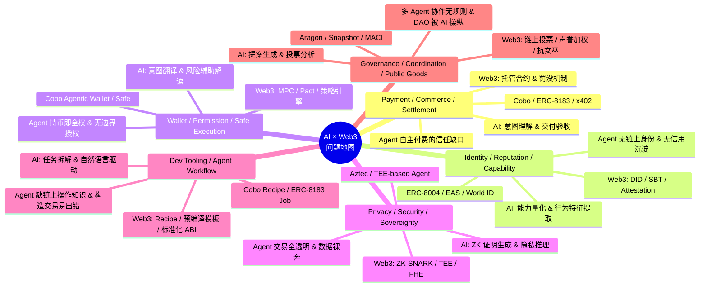
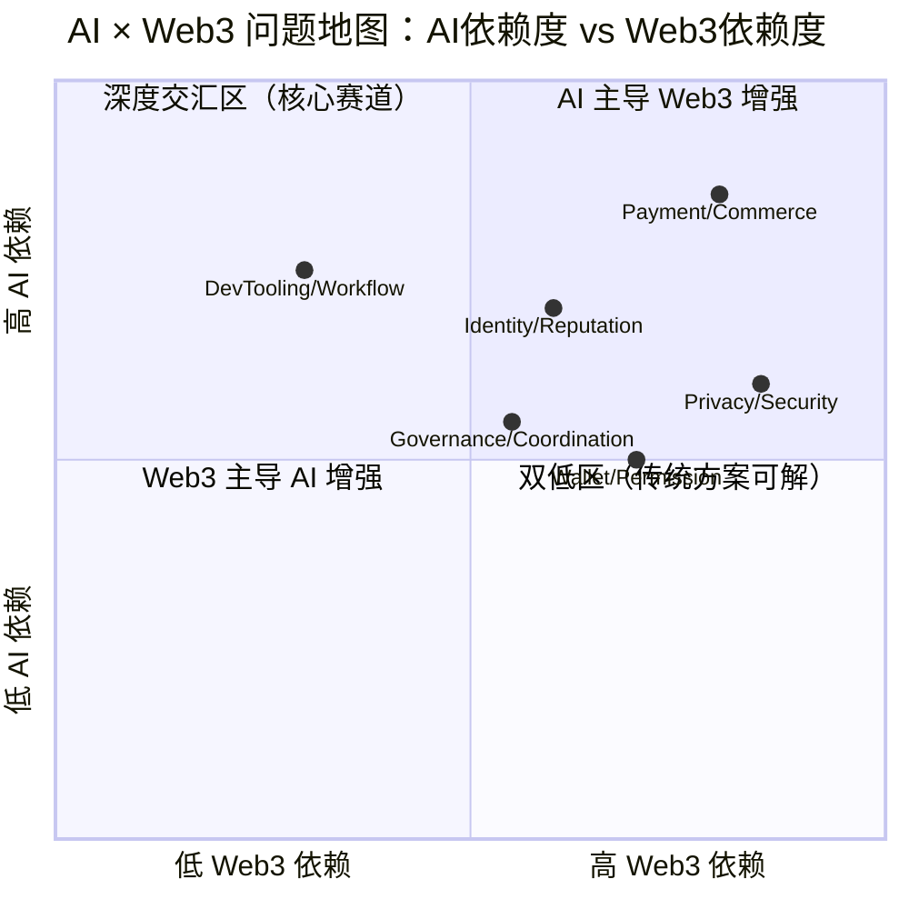
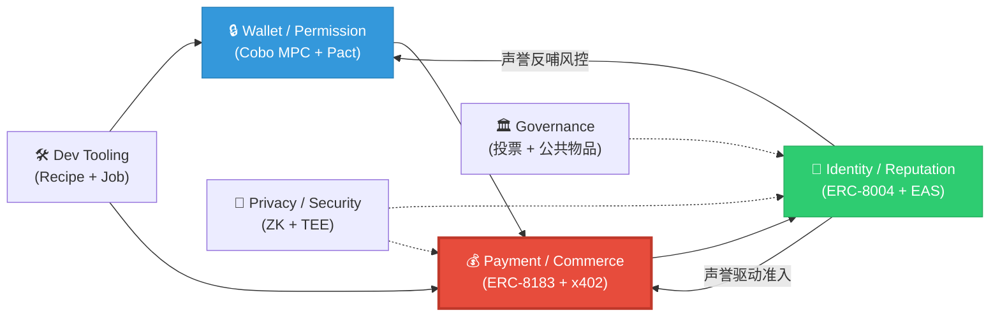

---
# 🗺️ AI × Web3 问题地图 — Week 2 Module A
> 主线方向：**Payment / Commerce / Settlement（链上 Agent 自主商业与可信结算）**
---
## 一、AI × Web3 问题地图总览
六大方向 × 三层拆解：每个方向列出**核心问题**、**AI 的作用**、**Web3 的机制**，以及**典型项目/协议**。

---
## 二、六大方向详细拆解
### 方向 1：Payment / Commerce / Settlement（支付 / 商业 / 结算）
| 维度 | 内容 |
| :--- | :--- |
| **核心问题** | Agent 自主消费时，**付了钱货不对板怎么办？** 资金无托管、交付无验收、作恶无惩罚、交易无凭证，机器之间无法安全地"做生意"。 |
| **AI 的作用** | ① **意图理解**：将人类自然语言需求转译为结构化 Job Intent ② **交付验收**：LLM / 规则引擎作为 Evaluator，判定 API 返回数据是否满足需求 ③ **动态定价**：基于数据质量与市场供需，辅助 Agent 做出合理报价 |
| **Web3 机制** | ① **链上托管（Escrow）**：ERC-8183 合约锁定资金，验收通过才释放 ② **罚没机制（Slashing）**：交付不合格时，质押金被罚没并退款 ③ **微支付协议**：x402 实现 HTTP 402 状态码级的按次付费 ④ **结算原子性**：一笔交易内完成"验货 + 付款"，不存在部分失败 |
| **典型项目** | ERC-8183、x402、Cobo Agentic Wallet、AEP v3.0 |
---
### 方向 2：Identity / Reputation / Capability / Interoperability（身份 / 声誉 / 能力 / 互操作）
| 维度 | 内容 |
| :--- | :--- |
| **核心问题** | Agent 无统一链上身份、无公开信誉体系、**换个地址就能洗白作恶记录**，跨平台无法识别和互信。 |
| **AI 的作用** | ① **能力量化**：评估 Agent 的交付成功率、响应速度、专业领域，生成标准化评分标签 ② **行为特征提取**：从海量交互日志中提取 Agent 的行为指纹 ③ **跨域适配**：辅助 Agent 在不同生态间翻译自身能力描述 |
| **Web3 机制** | ① **身份注册表**：ERC-8004 基于 ERC-721 为 Agent 铸造唯一 NFT 身份 ② **信誉注册表**：链上存储评价 Attestation，永久溯源、不可篡改 ③ **校验注册表**：提供标准化校验接口，对接 ZK/TEE/质押验证 ④ **跨链互操作**：通过链上 DID 实现多链身份统一 |
| **典型项目** | ERC-8004、EAS (Ethereum Attestation Service)、World ID、ERC-6551 |
---
### 方向 3：Wallet / Permission / Safe Execution（钱包 / 权限 / 安全执行）
| 维度 | 内容 |
| :--- | :--- |
| **核心问题** | Agent 拿到私钥就拥有无限权力，**一笔交易就能抽干钱包**。自然语言 Prompt 不具备强制约束力，Prompt Injection 可导致未授权交易。 |
| **AI 的作用** | ① **意图翻译**：将人类模糊意图转译为结构化 Execution Plan ② **风险辅助解读**：在 Pact 审批时，用自然语言向用户解释交易风险等级 ③ **异常检测**：实时监控 Agent 行为，发现意图偏移时拉起人类确认 |
| **Web3 机制** | ① **MPC 2-of-2 签名**：Agent + Cobo / Human + Cobo 共管，无单方能挪用资金 ② **Pact 授权协议**：Intent + Policy + Completion Condition 定义硬边界 ③ **Recipe 知识胶囊**：预编译安全操作模板，限制 Agent 只能走验证过的路径 ④ **到期自动 Revoke**：解决僵尸授权问题 |
| **典型项目** | Cobo Agentic Wallet、Safe (Gnosis Safe)、MetaMask Snaps |
---
### 方向 4：Privacy / Security / Sovereignty（隐私 / 安全 / 数据主权）
| 维度 | 内容 |
| :--- | :--- |
| **核心问题** | Agent 的所有交易和声誉完全透明，**商业策略暴露无遗**。用户敏感数据在 Agent 间流转时无隐私保护。 |
| **AI 的作用** | ① **ZK 证明生成**：AI 辅助生成零知识证明，证明"我的声誉 > 90 分"而不暴露具体交易历史 ② **隐私推理**：在 TEE/FHE 环境中运行模型，保护推理输入/输出 ③ **数据脱敏**：在 Agent 交互前自动识别和脱敏敏感字段 |
| **Web3 机制** | ① **ZK-SNARK/STARK**：链上验证证明而不暴露原始数据 ② **TEE（可信执行环境）**：链下安全计算，结果可验证 ③ **FHE（全同态加密）**：密文上直接计算，结果解密后明文一致 ④ **数据主权 NFT**：用户通过 NFT 控制数据授权范围和期限 |
| **典型项目** | Aztec、ZK Email、TEN (Obscuro)、Lit Protocol |
---
### 方向 5：Dev Tooling / Agent Workflow（开发工具 / Agent 工作流）
| 维度 | 内容 |
| :--- | :--- |
| **核心问题** | LLM **不具备链上操作知识**，临时构造交易参数极易出错。Agent 开发者缺乏标准化的链上任务编排框架。 |
| **AI 的作用** | ① **任务拆解**：将复杂目标分解为可执行的链上操作序列 ② **自然语言驱动**：用 NL2SQL / NL2Contract 方式降低开发门槛 ③ **错误自修复**：当交易 revert 时，AI 分析错误原因并自动修正参数重试 |
| **Web3 机制** | ① **Recipe / 预编译模板**：封装合约地址、ABI、安全边界，Agent 调用即执行 ② **标准化 Job 原语**：ERC-8183 将各类链上服务统一为 Job 结构 ③ **链上事件驱动**：Agent 订阅链上事件，触发后续工作流 ④ **模块化 Agent 框架**：可组合的 Skill / Plugin 架构 |
| **典型项目** | Cobo Recipe、ERC-8183 Job Framework、LangChain + Web3、Eliza |
---
### 方向 6：Governance / Coordination / Public Goods（治理 / 协调 / 公共物品）
| 维度 | 内容 |
| :--- | :--- |
| **核心问题** | 多 Agent 协作无规则、**DAO 投票可被 AI 批量操纵**、公共物品的资金分配缺乏客观评估。 |
| **AI 的作用** | ① **提案生成**：基于链上数据和社区讨论，自动生成治理提案 ② **投票分析**：分析提案影响，辅助人类/Agent 做出知情决策 ③ **公共物品评估**：量化项目贡献度，辅助资金分配 |
| **Web3 机制** | ① **链上投票**：Snapshot / Tally 等去中心化投票系统 ② **声誉加权**：基于 ERC-8004 声誉调整投票权重，抗女巫 ③ **流式支付**：Superfluid 等协议实现按贡献持续流式分配 ④ **反贿赂机制**：MACI 等协议防止投票购买 |
| **典型项目** | Aragon、Snapshot、MACI、Gitcoin Grants、Optimism RetroPGF |
---
## 三、深度分析：为什么它们既不是纯 AI 问题，也不是纯 Web3 问题？
### 🔍 方向 A：Payment / Commerce / Settlement
**为什么不是纯 AI 问题？**
纯 AI 只能解决"理解意图"和"判断质量"，但无法解决以下问题：
1. **资金安全无法靠 AI 承诺**：AI 说"我只花 100U"，但 Prompt 不是 Policy，幻觉或注入攻击可让 AI 突破承诺。必须有链上合约级的硬锁定。
2. **交付争议无法靠 AI 一言堂**：如果 AI 既是买方又是裁判，无法保证公正。必须有链上托管合约作为中立第三方，且验收结果必须链上存证。
3. **罚没执行无法靠 AI 自觉**：AI 无法"自己罚自己"。必须有合约自动执行 Slashing，作恶者的质押金被强制扣除。
> **一句话**：AI 能判断"这笔交易该不该付"，但**只有合约能保证"不该付的钱绝对付不出去"**。
**为什么不是纯 Web3 问题？**
纯 Web3（合约 + 链上逻辑）只能解决"规则执行"，但无法解决以下问题：
1. **交付质量判定需要 AI**：链上合约无法判断"这段 JSON 数据是否回答了用户的问题"。必须引入 LLM-as-a-Judge 或规则引擎作为 Evaluator。
2. **意图结构化需要 AI**：用户说"帮我买点以太坊"，合约不理解自然语言。必须由 AI 将意图转译为结构化 Job Intent + Execution Plan。
3. **动态适应需要 AI**：API 格式变更、新的攻击手法出现，硬编码的合约规则无法实时响应。AI 可以动态调整验收策略。
> **一句话**：合约能保证"规则被严格执行"，但**只有 AI 能判断"这个结果是否真的满足用户需求"**。
**交汇本质**：这个方向的核心是 **"可验证结算"** —— AI 负责语义层的验收判定，Web3 负责经济层的强制执行。缺了 AI，合约只会机械地超时退款；缺了 Web3，AI 的承诺毫无约束力。
---
### 🔍 方向 B：Wallet / Permission / Safe Execution
**为什么不是纯 AI 问题？**
1. **AI 无法保证私钥安全**：无论 AI 多聪明，私钥一旦泄露或被 Agent 单独持有，AI 无法阻止资金被转走。必须有 MPC 等密码学方案确保无单点控制。
2. **AI 无法强制执行风控规则**：AI 可以"建议"Agent 不要超额花费，但无法"阻止"Agent 发起交易。必须由 Pact 策略引擎在签名层拦截。
3. **AI 无法做到链上可审计**：AI 的决策过程是黑盒。必须由链上存证提供不可篡改的审计轨迹。
> **一句话**：AI 能"建议你不要做"，但**只有密码学 + 链上策略引擎能"让你做不了"**。
**为什么不是纯 Web3 问题？**
1. **合约不理解人类意图**：Pact 的 Policy 规则需要有人来生成。AI 将人类模糊意图转译为精确的 Policy 参数（额度、白名单、到期时间）。
2. **风控规则需要 AI 动态调整**：静态规则无法应对新型攻击模式。AI 可以基于实时行为分析，动态建议调整 Pact 的 Policy。
3. **用户友好的审批体验需要 AI**：链上交易数据对普通用户不可读。AI 将复杂的交易参数翻译为人类可理解的风险提示。
> **一句话**：合约能"阻止越界交易"，但**只有 AI 能"把人类的模糊想法变成合约能执行的精确规则"**。
**交汇本质**：这个方向的核心是 **"可信执行边界"** —— AI 负责意图翻译和动态风控，Web3 负责硬性约束和不可绕过的执行保障。
---
## 四、主线选择：Payment / Commerce / Settlement
### 选择理由
| 评估维度 | Payment / Commerce / Settlement | Wallet / Permission | Identity / Reputation | Privacy / Security | Dev Tooling | Governance |
| :--- | :---: | :---: | :---: | :---: | :---: | :---: |
| 与已有项目的契合度 | ⭐⭐⭐ | ⭐⭐ | ⭐⭐⭐ | ⭐ | ⭐⭐ | ⭐ |
| 问题的不可替代性 | ⭐⭐⭐ | ⭐⭐ | ⭐⭐ | ⭐⭐ | ⭐ | ⭐ |
| AI × Web3 交汇深度 | ⭐⭐⭐ | ⭐⭐ | ⭐⭐ | ⭐⭐ | ⭐⭐ | ⭐⭐ |
| 生态扩展性 | ⭐⭐⭐ | ⭐⭐ | ⭐⭐⭐ | ⭐⭐ | ⭐⭐ | ⭐⭐ |
| 可演示性 | ⭐⭐⭐ | ⭐⭐ | ⭐⭐ | ⭐ | ⭐⭐ | ⭐ |
### 主线定位
> **Week 2 主线：Payment / Commerce / Settlement —— 链上 Agent 自主商业的可信结算**
>
> 聚焦解决：当 AI Agent 自主购买链上服务（API 数据、算力、模型推理）时，如何通过 **AI 语义验收 + 链上托管合约 + 声誉惩罚机制**，实现"付钱必得货、货差必退款、作恶必惩罚"的可信商业闭环。
>
> 后续拆解和 proposal 将围绕以下子问题推进：
> 1. **验收层**：如何设计双模评估引擎（LLM + 规则），兼顾准确性与经济性？
> 2. **结算层**：如何优化 ERC-8183 的状态机，适配梯度罚没与微支付场景？
> 3. **声誉层**：如何将 8183 的验收结果写入 ERC-8004，形成跨任务、跨平台的声誉飞轮？
> 4. **集成层**：如何与 Cobo Agentic Wallet（MPC + Pact + Recipe）端到端打通？
---
## 五、问题地图可视化（矩阵视角）

**解读**：
- **Payment / Commerce / Settlement** 落在"深度交汇区"，AI 依赖度和 Web3 依赖度都很高——AI 负责语义验收，Web3 负责强制执行，二者缺一不可，是 AI × Web3 最核心的交汇赛道。
- **Wallet / Permission** 偏 Web3 依赖（密码学 + 合约是核心），AI 是增强而非必需。
- **Dev Tooling** 偏 AI 依赖（任务拆解和代码生成是核心），Web3 提供标准化模板。
- **Governance** 处于中间位置，AI 和 Web3 各有贡献但都不极端。
---
## 六、方向间的依赖关系图

**核心依赖链**：
1. **Wallet → Payment**：Agent 必须先有安全的持币和授权能力，才能进行商业交易。
2. **Payment → Reputation**：商业交易的验收结果沉淀为链上声誉。
3. **Reputation → Wallet & Payment**：声誉数据反哺风控策略（低声誉 = 高质押率 / 低额度）。
> **AEP 覆盖了这条依赖链的核心段（Payment + Reputation），并通过集成 Cobo 补齐了 Wallet 层。**
---
*本文档将作为 Week 2 及后续 proposal 的基础框架，所有拆解和分析将围绕 **Payment / Commerce / Settlement** 方向持续深化。*

### 合规提交说明
本文档为 AI × Web3 方向分析与项目规划文档，仅包含理论分析、架构设计、流程图表与行业协议介绍。
文档内**无任何私钥、助记词、API Key、密钥、钱包账户、.env 配置**等敏感隐私信息，完全符合平台提交要求。
