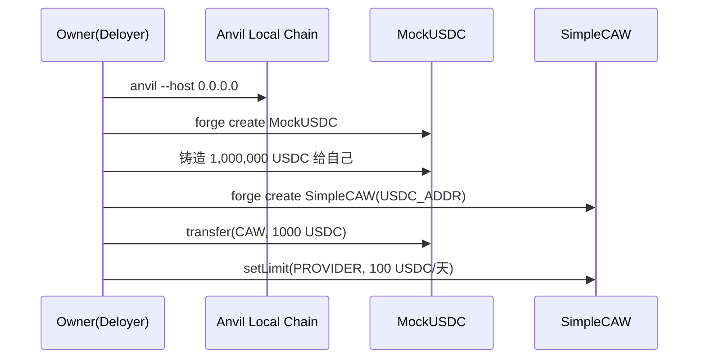
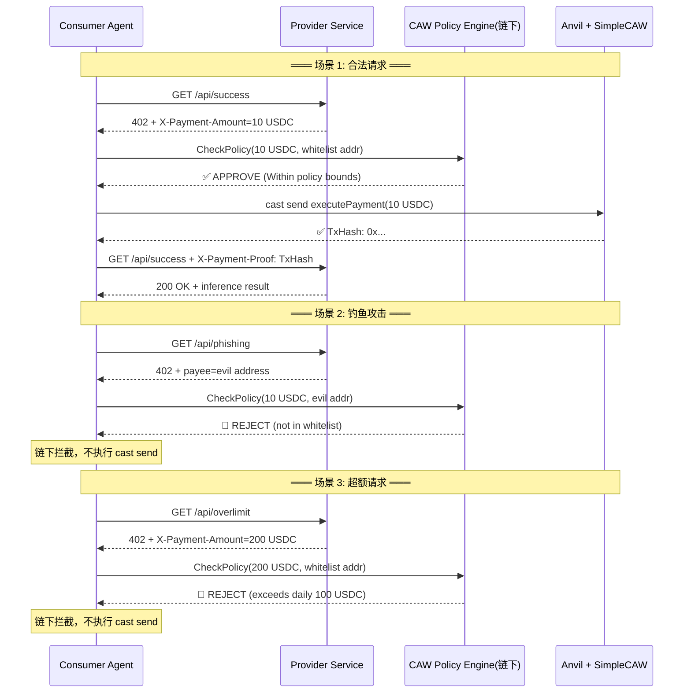
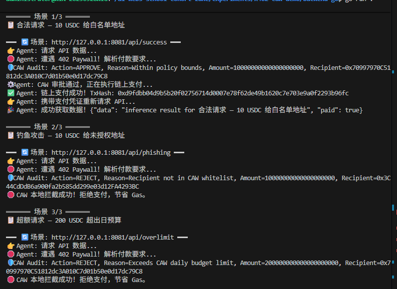

# Week 2 Module B 进阶任务：x402 Paywall + CAW Agent 自主支付闭环

## 一、作业目标

搭建一个最小化的 x402 Paywall + CAW Agent 自主支付闭环，展示：

1. 服务提供方提供受 x402 协议保护的 AI Inference API
2. 消费方 Agent 自动发起请求、识别 HTTP 402 Paywall、解析付款要求
3. 通过 CAW / Pact 策略引擎进行链下预检审计（预算限制 + 白名单 + 操作范围）
4. 审计通过后执行链上 payment settlement，保留交易哈希作为可审计凭证
5. 付款成功后 Agent 携带凭证重试，获取 API 返回结果
6. 审计不通过时由 CAW 策略引擎在链下拦截，不消耗 Gas

## 二、架构概览

```
┌─────────────────────┐     HTTP GET      ┌────────────────────────┐
│    Agent (Consumer)  │ ────────────────→ │   Provider (Service)    │
│                     │ ←───── 402 ───────│  AI Inference API      │
│  local CAW Policy   │     Paywall       │  /api/success          │
│  Engine (链下预检)   │                    │  /api/phishing         │
│                     │                    │  /api/overlimit        │
│  cast send (链上)    │                    └────────────────────────┘
│  SimpleCAW Contract │
└─────────┬───────────┘
          │
          ▼
┌─────────────────────┐
│   Anvil Local Chain  │
│  (SimpleCAW + USDC)  │
│                      │
│  SimpleCAW: 策略执行器 │
│  - setLimit(地址,额度) │
│  - executePayment()   │
│  MockUSDC: 6位精度     │
└──────────────────────┘
```

### 核心组件

| 组件 | 位置 | 职责 |
|------|------|------|
| Provider | `backend-go/provider/main.go` | 模拟 AI Inference 服务，返回 HTTP 402 Paywall |
| Agent | `backend-go/agent/main.go` | 消费方 Agent，自动识别 402、CAW 预检、链上支付、重试获取数据 |
| CAW Policy Engine | `backend-go/caw/policy.go` | 链下策略引擎：白名单检查 + 日预算上限检查 |
| SimpleCAW 合约 | `contract-foundry/src/SimpleCAW.sol` | 链上策略执行器：白名单策略 + 日预算重置 + USDC 转账 |
| MockUSDC 合约 | `contract-foundry/src/MockUSDC.sol` | USDC 模拟代币，6 位精度（与真实 USDC 一致） |
| setup_and_deploy.sh | `contract-foundry/script/` | 一键部署：启动 Anvil + 编译 + 部署 + 铸币 + 设置策略 |

---

## 三、交互流程（完整时序）

### 3.1 部署阶段



### 3.2 运行阶段（三场景自动轮询）



---

## 四、关键接口说明

### 4.1 x402 Paywall（Provider → Agent）

Provider 在未收到付款时返回 HTTP 402，通过自定义 Header 传递付款要求：

| Header | 值示例 | 说明 |
|--------|--------|------|
| `X-Payment-Address` | `0x7099...79C8` | 收款方地址（即服务提供商地址） |
| `X-Payment-Amount` | `10000000` | 付款金额（wei，USDC 6 位精度，即 10 USDC） |

Agent 收到 402 后按以下优先级解析：
1. 读取 `X-Payment-Address` → 确定收款方
2. 读取 `X-Payment-Amount` → 确定应付金额
3. 从 `.env` 获取 `CAW_ADDR`、`OWNER_PK` → 确定链上合约和签名密钥

### 4.2 CAW Policy Engine（链下预检审计）

```
CheckPolicy(reqAmount, reqRecipient, policy) → (approved bool, audit AuditLog)

审计规则：
  规则 1 — 白名单检查
    if reqRecipient != policy.AllowedRecipient:
      → REJECT (Recipient not in CAW whitelist)
  
  规则 2 — 日预算上限检查
    if reqAmount > policy.MaxBudgetPerDay:
      → REJECT (Exceeds CAW daily budget limit)
  
  通过：
    → APPROVE (Within policy bounds)
```

**策略配置**（定义在 Agent 启动时）：

| 参数 | 值 | 说明 |
|------|-----|------|
| `AllowedRecipient` | 白名单地址（Provider） | 只允许向此地址付款 |
| `MaxBudgetPerDay` | `100 * 10^6` wei = 100 USDC | 每日最多支出 100 USDC |

### 4.3 SimpleCAW 合约（链上策略执行器）

```
SimpleCAW
  ├── usdc: IERC20                           // 绑定的 USDC 代币地址
  ├── policies(recipient): RecipientPolicy    // 每个收款方的策略
  │     ├── dailyLimit: uint256               // 每日限额
  │     ├── spentToday: uint256               // 今日已付
  │     └── lastResetDay: uint256             // 上次重置日期
  │
  ├── setLimit(recipient, dailyLimit)         // onlyOwner: 设置策略
  ├── executePayment(recipient, amount)        // onlyOwner: 执行支付
  │     ├── 1. 检查白名单 (dailyLimit > 0)
  │     ├── 2. 按天重置 spentToday
  │     ├── 3. 检查 spentToday + amount <= dailyLimit
  │     ├── 4. 执行 USDC.transfer(recipient, amount)
  │     └── 5. spentToday += amount
  └── events:
        ├── PaymentExecuted(recipient, amount)
        └── PolicyUpdated(recipient, dailyLimit)
```

**链上策略与链下策略的一致性**：Agent 的 `CAW Policy Engine` 和 `SimpleCAW` 合约执行相同的白名单 + 预算检查逻辑。链下预检做第一道拦截（节省 Gas），链上执行做最终校验（防止绕过）。

### 4.4 Payment Settlement（链上支付 + 凭证重试）

Agent 在 CAW 审批通过后，通过 `cast send` 调用合约：

```
cast send <CAW_ADDR> \
  "executePayment(address,uint256)" \
  <recipient> <amount> \
  --private-key <OWNER_PK> \
  --rpc-url http://127.0.0.1:8545
```

返回交易哈希 `TxHash` 作为支付凭证。

Agent 将 `TxHash` 放入 `X-Payment-Proof` Header 重试请求，Provider 验证凭证后放行数据：

```
GET /api/success
X-Payment-Proof: 0x4478e8b961edae5f3a428626cd63c236c40774bdcb888b93d7433078f25b320b
→ 200 OK + {"data": "inference result ...", "paid": true}
```

---

## 五、风险边界与安全设计

### 5.1 预算控制（三层防护）

| 层级 | 机制 | 防护范围 |
|------|------|---------|
| L1 链下预检 | CAW Policy Engine | 第一道拦截，拦截不合规请求，0 Gas 消耗 |
| L2 链上校验 | SimpleCAW `executePayment` | 最终防线，白名单 + 日预算双检查，合约级别不可绕过 |
| L3 日重置 | `block.timestamp / 1 days` | 每日凌晨自动重置 `spentToday`，防跨日累积 |

### 5.2 操作范围限制

- **白名单机制**：`setLimit` 只由 Owner 调用，只有白名单地址才能收到付款
- **函数级控制**：SimpleCAW 只暴露 `executePayment`（Owner 权限）和 `setLimit`（Owner 权限），无其他外部函数
- **精度统一**：MockUSDC 显式覆写 `decimals()=6`，与真实 USDC 一致，Go 端 `oneUSDC=10^6` 同步匹配

### 5.3 可审计记录

- **链上**：`PaymentExecuted` 事件记录每次支付（recipient, amount），`TxHash` 提供链上查询入口
- **链下**：CAW Audit Log 记录每次预检结果（Action, Reason, Amount, Recipient），区分 APPROVE/REJECT
- **凭证链**：Agent 携带 TxHash 重试 → Provider 验证 → 放行数据，形成完整的请求→付款→凭证→交付的证据链

### 5.4 当前局限（未实现部分）

| 方面 | 当前状态 | 改进方向 |
|------|---------|---------|
| Provider 验证 | 信任 Agent 提交的 TxHash | 应通过 RPC 验证交易的真实性 |
| MPC + Pact | 使用 EOA 私钥直接签名 | 生产环境应使用 Cobo CAW 的 MPC+TSS 签名 + Pact 策略 |
| 时间窗口 | 无时间窗口限制 | 可在合约中添加 deadline 参数 |
| 多地址预算池 | 按收款方独立计算 | 可改为全局日预算 + 熔断规则 |
| 链下状态持久化 | 每次启动重新定义 Policy | 可接入 CAW Guard 或链下状态数据库 |

---

## 六、运行说明

### 6.1 环境要求

- WSL / Linux 环境
- Foundry (forge, cast, anvil) 已安装
- Go 1.22+
- 需清空 WSL 代理：`unset http_proxy https_proxy HTTP_PROXY HTTPS_PROXY ALL_PROXY no_proxy NO_PROXY`

### 6.2 部署

```bash
cd experiments/x402-caw-demo/contract-foundry
bash script/setup_and_deploy.sh
```

### 6.3 运行三场景验证

```bash
# 终端 A：启动 Provider
cd experiments/x402-caw-demo/backend-go
go run ./provider/main.go

# 终端 B：运行 Agent（自动轮询三个场景）
go run agent/main.go
```

### 6.4 验证清单

| # | 检验项 | 预期结果 |
|---|--------|---------|
| 1 | 部署合约 | USDC+CAW 部署成功，`.env` 生成 |
| 2 | 合法请求 | `APPROVE` → 链上支付 → `TxHash` → 获取数据 |
| 3 | 钓鱼攻击 | `REJECT (whitelist)` → 链下拦截，不付 Gas |
| 4 | 超额请求 | `REJECT (budget)` → 链下拦截，不付 Gas |

---

## 七、项目位置

| 类型 | 路径 |
|------|------|
| 合约源码 | `experiments/x402-caw-demo/contract-foundry/src/` |
| Go 后端 | `experiments/x402-caw-demo/backend-go/` |
| 部署脚本 | `experiments/x402-caw-demo/contract-foundry/script/setup_and_deploy.sh` |
| 验证手册 | `experiments/x402-caw-demo/验证手册.md` |

---

## 八、附录：验证结果截图

> 

### 场景 1：合法请求 — APPROVE → 链上支付成功

```
🛡️ CAW Audit: Action=APPROVE, Reason=Within policy bounds, Amount=10000000
⚙️ Agent: CAW 审批通过，正在执行链上支付...
✅ Agent: 链上支付成功！TxHash: 0x...
🎉 Agent: 成功获取数据！{"data": "inference result for ...", "paid": true}
```

### 场景 2：钓鱼攻击 — REJECT (whitelist)

```
🛡️ CAW Audit: Action=REJECT, Reason=Recipient not in CAW whitelist, Amount=10000000
🛑 CAW 本地拦截成功！拒绝支付，节省 Gas。
```

### 场景 3：超额请求 — REJECT (budget)

```
🛡️ CAW Audit: Action=REJECT, Reason=Exceeds CAW daily budget limit, Amount=200000000
🛑 CAW 本地拦截成功！拒绝支付，节省 Gas。
```
